# 
 Universidad Peruana de Ciencias Aplicadas 

  

### 
 Informe de Trabajo Final 

 

  
 Carrera: Ingeniería de Software 

   
  
 Ciclo: 2024-2 

   
  
 Curso: Desarrollo de Aplicaciones Open Source 

   
  
 Sección: WX51 

   
  
 Profesor: Alberto Wilmer Sanchez Seña 

   
  
 Nombre del Startup: Cup of Tech 

   
  
 Nombre del Producto: Grow With Me 

   
  
 Relación de Integrantes: 

  
  - Alonso Garay, Diego Jesus (u20221d014) 

  
  - Briceño De La Cruz, Farid Sebastian (u20211f211) 

  
  - Landeo Simeón, Favio Sebastián (u202119588) 

  
  - Paucar Meneses, Jeremy Alion (u201719449) 

  
  - Rivera Ayala, Gabriel Alejandro (u202223279)

   
  
 Mes y Año: Agosto del 2024 

---

# Registro de Versiones del Informe
<table>
  <tr>
    <th style="text-align:center;">Versión</th>
    <th style="text-align:center;">Fecha</th>
    <th style="text-align:center;">Autor</th>
    <th style="text-align:center;">Descripción de la modificación</th>
  </tr>
  <tr>
    <td align="center">TB1</td>
    <td>11/04/2024</td>
    <td> Todos </td>
    <td> Realizamos los capítulos 1, 2, 3, 4 y 5 según la rúbrica de manera conjunta y eficiente.  </td>
  </tr>
</table>

---

# Project Report Collaboration Insights
TB1: Las tareas asignadas para la entrega TB1 se han completado y están documentadas en el repositorio de Github.

- Se escribieron y diagramaron los contenidos asignados a cada miembro en formato Markdown, seguido de commits para asegurar el progreso en el repositorio.
- Se organizaron reuniones para coordinar el progreso de los elementos del informe y para comunicar los avances del Sprint 1.

---

# Tabla de contenidos
- [Carátula](#caratula)
- [Registro de Versiones del Informe](#registro-de-versiones-del-informe)
- [Project Report Collaboration Insights](#project-report-collaboration-insights)
- [Student Outcome](#student-outcome)
- [Capítulo I: Introducción](#capítulo-i-introducción)
    - [1.1 Startup Profile](#11-startup-profile)
        - [1.1.1 Descripción de la Startup](#111-descripción-de-la-startup)
    - [1.1.2 Perfiles de integrantes del equipo](#112-perfiles-de-integrantes-del-equipo)
    - [1.2 Solution Profile](#12-solution-profile)
        - [1.2.1 Antecedentes y problemática](#121-antecedentes-y-problemática)
        - [1.2.2 Lean UX Process](#122-lean-ux-process)
            - [1.2.2.1 Lean UX Problem Statements](#1221-lean-ux-problem-statements)
            - [1.2.2.2 Lean UX Assumptions](#1222-lean-ux-assumptions)
            - [1.2.2.3 Lean UX Hypothesis Statements](#1211-lean-ux-hyphotesis-statements)
            - [1.2.2.4 Lean UX Canvas](#1224-lean-ux-canvas)
        - [1.3 Segmentos objetivo](#13-segmentos-objetivo)
- [Capítulo II: Requirements Elicitation & Analysis](#capítulo-ii-requirements-elicitation--analysis)
    - [2.1 Competidores](#21-competidores)
        - [2.1.1 Análisis competitivo](#211-análisis-competitivo)
        - [2.1.2 Estrategias y tácticas frente a competidores](#212-estrategias-y-tácticas-frente-a-competidores)
    - [2.2 Entrevistas](#22-entrevistas)
        - [2.2.1 Diseño de entrevistas](#221-diseño-de-entrevistas)
        - [2.2.2 Registro de entrevistas](#222-registro-de-entrevistas)
        - [2.2.3 Análisis de entrevistas](#223-análisis-de-entrevistas)
    - [2.3 Needfinding](#23-needfinding)
        - [2.3.1 User Personas](#231-user-personas)
        - [2.3.2 User Task Matrix](#232-user-task-matrix)
        - [2.3.3 User Journey Mapping](#233-user-journey-mapping)
        - [2.3.4 Empathy Mapping](#234-empathy-mapping)
        - [2.3.5 As-is Scenario Mapping](#235-as-is-scenario-mapping)
    - [2.4 Ubiquitous Language](#24-ubiquitous-language)

- [Capítulo III: Requirements Specification](#capítulo-iii-requirements-specification)
    - [3.1 To-Be Scenario Mapping](#31-to-be-scenario-mapping)
    - [3.2 User Stories](#32-user-stories)
    - [3.3 Impact Mapping](#33-impact-mapping)
    - [3.4 Product Backlog](#34-product-backlog)

- [Capítulo IV: Product Design](#capítulo-iv-product-design)
    - [4.1 Style Guidelines](#41-style-guidelines)
        - [4.1.1 General Style Guidelines](#411-general-style-guidelines)
        - [4.1.2 Web Style Guidelines](#412-web-style-guidelines)
    - [4.2 Information Architecture](#42-information-architecture)
        - [4.2.1 Organization Systems](#421-organization-systems)
        - [4.2.2 Labeling Systems](#422-labeling-systems)
        - [4.2.3 SEO Tags and Meta Tags](#423-seo-tags-and-meta-tags)
        - [4.2.4 Searching Systems](#424-searching-systems)
        - [4.2.5 Navigation Systems](#425-navigation-systems)
    - [4.3 Landing Page UI Design](#43-landing-page-ui-design)
        - [4.3.1 Landing Page Wireframe](#431-landing-page-wireframe)
        - [4.3.2 Landing Page Mock-up](#432-landing-page-mock-up)
    - [4.4 Web Applications UX/UI Design](#44-web-applications-uxui-design)
        - [4.4.1 Web Applications Wireframes](#441-web-applications-wireframes)
        - [4.4.2 Web Applications Wireflow Diagrams](#442-web-applications-wireflow-diagrams)
        - [4.4.3 Web Applications Mock-ups](#443-web-applications-mock-ups)
        - [4.4.4 Web Applications User Flow Diagrams](#444-web-applications-user-flow-diagrams)
    - [4.5 Web Applications Prototyping](#45-web-applications-prototyping)
    - [4.6 Domain-Driven Software Architecture](#46-domain-driven-software-architecture)
        - [4.6.1 Software Architecture Context Diagram](#461-software-architecture-context-diagram)
        - [4.6.2 Software Architecture Container Diagrams](#462-software-architecture-container-diagrams)
        - [4.6.3 Software Architecture Components Diagrams](#463-software-architecture-components-diagrams)
    - [4.7 Software Object-Oriented Design](#47-software-object-oriented-design)
        - [4.7.1 Class Diagrams](#471-class-diagrams)
        - [4.7.2 Class Dictionary](#472-class-dictionary)
    - [4.8 Database Design](#48-database-design)
        - [4.8.1 Database Diagram](#481-database-diagram)

- [Capítulo V: Product Implementation, Validation & Deployment](#capítulo-v-product-implementation-validation--deployment)
    - [5.1 Software Configuration Management](#51-software-configuration-management)
        - [5.1.1 Software Development Environment Configuration](#511-software-development-environment-configuration)
        - [5.1.2 Source Code Management](#512-source-code-management)
        - [5.1.3 Software Development Environment Configuration](#513-source-code-style-guide--conventions)
        - [5.1.4 Software Deployment Configuration](#514-software-deployment-configuration)
    - [5.2 Landing Page, Services & Applications Implementation](#52-landing-page-services-applications-implementation)
        - [5.2.1 Sprint 1](#521-sprint-1)
            - [5.2.1.1 Sprint Planning 1](#5211-sprint-planning-1)
            - [5.2.1.2 Sprint Backlog 1](#5212-sprint-backlog-1)
            - [5.2.1.3 Development Evidence for Sprint Review](#5213-development-evidence-for-sprint-review)
            - [5.2.1.4 Testing Suite Evidence for Sprint Review](#5214-testing-suite-evidence-for-sprint-review)
            - [5.2.1.5 Execution Evidence for Sprint Review](#5215-execution-evidence-for-sprint-review)
                       - [5.2.1.6 Services Documentation Evidence for Sprint Review](#5216-services-documentation-evidence-for-sprint-review)
            - [5.2.1.7 Software Deployment Evidence for Sprint Review](#5217-software-deployment-evidence-for-sprint-review)
            - [5.2.1.8 Team Collaboration Insights during Sprint](#5218-team-collaboration-insights-during-sprint)
- [Conclusiones](#conclusiones)
    - [Video About-the-Team](#video-about-the-team)
- [Bibliografía](#bibliografía)
- [Anexos](#anexos)
         
---

# Student Outcome
**ABET – EAC - Student Outcome 3**
Capacidad de comunicarse efectivamente con un rango de audiencias.  
<table>
    <tr>
        <th style="text-align:center;">Criterio específico</th>
        <th style="text-align:center;">Acciones realizadas</th>
        <th style="text-align:center;">Conclusiones</th>
    </tr>
    <tr>
        <td align="center">Comunica oralmente con efectividad a diferentes rangos de audiencia.</td>
        <td>
<strong> Alonso Garay, Diego Jesus </strong>  
TB1  
 
 
<strong> Briceño De La Cruz, Farid Sebastian </strong>  
TB1  
 
 
<strong> Landeo Simeón, Favio Sebastián </strong>  
TB1  
 
 
<strong> Paucar Meneses, Jeremy Alion </strong>  
TB1  
 
 
<strong> Rivera Ayala, Gabriel Alejandro </strong>  
TB1  
        </td>
        <td>(text)</td>
    </tr>
    <tr>
        <td align="center">Comunica por escrito con efectividad a diferentes rangos de audiencia</td>
        <td>
<strong> Alonso Garay, Diego Jesus </strong>  
TB1  
 
 
<strong> Briceño De La Cruz, Farid Sebastian </strong>  
TB1  
 
 
<strong> Landeo Simeón, Favio Sebastián </strong>  
TB1  
 
 
<strong> Paucar Meneses, Jeremy Alion </strong>  
TB1  
 
 
<strong> Rivera Ayala, Gabriel Alejandro </strong>  
TB1  
        </td>
        <td>(text)</td>
    </tr>
</table>

---

# Capítulo I: Introducción

---

# Capítulo II: Requirements Elicitation & Analysis
## 2.1 Competidores
Dentro del mercado al que planeamos brindar una solución, pudimos identificar varios competidores que ofrecen una solución con un enfoque similar para la gestión agrícola. A continuación, resumiremos su solución de Software:

**Agrobit:** Agrobit es una herramienta de gestión de gestión agrícola y ganadera que busca nuevas formas de producir alimentos de manera sustentable y rentable. Esta solución tiene como enfoque las grandes empresas. Su plataforma cuenta con funciones como, control de actividades, evolución de cultivos y monitoreo predictivo y trazabilidad y huella de carbono.  
**Efemis:** Efemis es una plataforma digital para la gestión agricola, utiliza imagenes satelitales, predicciones del clima y sensores para controlar los costes y optimizar los costes de operaciones agricolas. Es una iniciativa creada por hispatec que cuenta con soluciones diferentes para el sector agrícola para tareas más especificas, sin embargo, Efemis es la principal. 
**Agri:** Agri es un software especializado en el sector agrícola que permite gestionar órdenes de aplicación, control de faenas, cosecha y riego, entre otras funciones. Para acceder a sus servicios, el territorio agrícola debe ser revisado y categorizado por el tamaño del mismo, posteriormente se hace un cobro mensual que va desde 320 dólares para las pequeñas empresas agrícolas hasta 715 dólares para las empresas agrícolas grandes. 

### 2.1.1 Análisis competitivo
¿Por qué llevar a cabo este análisis? 
Debemos llevar a cabo este análisis para poder saber en que se especializan nuestros competidores directos y poder encontrar algún aspecto en el que podamos destacar y llamar la atención del mercado objetivo.
| Nombre | [Agroges] | [Agrobit] | [Efemis] | [Agri] |
|--------- |-----------|-----------|----------|-----------|
| Overview | Software de gestión agricola centrado en la capacitación del usuario que puede adaptarse a sus necesidades  | Software enfocado en la gestión de procesos agrícolas y ganaderos con ayuda de herramientas de alta gama | Software de hispatec que gestiona procesos agrícolas utilizando herramientas de alta gama  | Agri es una solución de software latina que permite gestionar campos de cultivo de forma centralizada  | 
| Ventaja Competitiva | Esta aplicación está entrada en el usuario y su adaptabilidad, brindandole a este una opción cómoda al alcane de sus manos | Uso de herramientas de alta gama como imagenes satelitales que son una alternativa que brinda una seguridad total | Este software modular, está diseñado para que el usuario quiera añadir más funcionalidades que se acoplen a sus necesidades | Empresa latinoamericana con la que los usuarios se sienten más cómodos|
| Mercado Objetivo | Nos enfocaremos en los pequeños y grandes agricultores que no hayan implementado tecnología para aligerar su carga laboral | Se centra en el sector ganadero y agrícola que buscan implementar una solucion tecnológica con herramientas de gama alta, como imagenes satelitales | Sector agrícola grande que busca una solución de software para agilizar procesos | Está centrado en pequeñas, medianas y grandes empresas agrícolas  | 
| Estrategias de marketing | Nos acercaremos a los empresarios agrícolas que no confían en la tecnología para que podamos demostrar la eficacia de esta | Se promociona mediante publicidad como google ads, correos,etc. | Utiliza publicidad y estrategias de marketing | Agri usa sus redes sociales como Instagram y Linkedin para poder difundir sus propuestas de valor| 
| Productos y Servicios| Ofrecemos una amplia variedad de recursos para el usuario como, control de inventario, predicciones del clima, sensores de humedad y temperatura, monitoreo de ventas, predicciones para las cosechas y un control de ventas| Cuenta con dos versiones, la ECO, una versión dedicada para una producción netamente sostenible, y la Enterprise, dedicada a conseguir el mayor beneficio económico para la empresa. Ambas opciones cuentan con planes de pago diferentes que varían, dandole a las grandes empresas agricolas más ventajas que a las más pequeñas | Efemis cuenta con un control de costos de operaciones, monitoreos de cumplimiento de normativas,gestion de actividades, tratamientos y riegos,entre otras | Agri cuenta con controles de faenas, compras y bodegaje, control de riego, entre otros. | 
| Precios y Costos| Planeamos cobrar una comisión por venta de productos, los usuarios podrán acceder a nuestros servicios sin mayor problema | Agrobit cuenta con planes mensuales que rondan los 250 hasta los 1100 dólares | Cuenta con planes principalmente desde los 300 hasta los 900 euros mensuales | Cuenta con 3 planes para los pequeños, medianos y grandes agricultores cuyos costos van desde los 320 hasta los 750 dólares | 
| Fortalezas | Contamos con un software ágil, que se verá sujetos a cambios rápidos para acomodarnos a las necesidades del usuario | Cuenta con una reputación y una clientela fiel | Es parte de una corporación grande que facilita acceso a herramientas de gama alta | Cuenta con clientes en todo latinoamerica sobre todo Chile y Perú | 
| Debilidades | Sujeta a pruebas | Está cerrada a sus clientes habituales y los clientes nuevos no parecen interesados en su producto | No cuenta con una gran cantidad de clientes, las reseñas no son buenas y está siendo dejada de lado | No parece querer modernizarse más allá de su estado actual | 
| Oportunidades| Muchas de las gestiones agrícolas en nuestro país son deficientes y gran parte de las cosechas son desperdiciadas, por ello el Perú es un país ideal para implementar agroges  | Dadas sus herramientas presenta una estabilidad que les permitiría desarrollarse más | Cuenta con acceso a herramientas de gama alta que permiten el recopilado de información detallada para beneficio del usuario |    Cuenta con el apoyo de clientes de más de un país por ello pueden expandirse por todo latinoamerica | 
| Amenazas| La implementación de herramientas costosas por parte de la competencia | Dado que el proceso de cotización es lento, muchos clientes prefieren buscar otras opciones | Sus ventas se han visto reducidas  | La creciente tecnología y el uso de la inteligencia artificial puede desplazar a muchas soluciones de software | 

### 2.1.2 Estrategias y tácticas frente a competidores
Nos enfocaremos en el sector que no cuenta con tecnología, brindando una solución accesible e intuitiva para que personas que no están familiarizadas con el apartado tecnológico puedan dominar para el uso eficiente de sus recursos.
  
**Estrategia general**: Diferenciacición  
**Objetivo principal:** Destacar ante la competencia enfocandonos en hacer un producto que pueda satisfacer necesidades específicas de nuestros segmentos objetivos.
   
**Estrategias Clave:** 
<ul>
    <li>Enfoque al usuario: Concentrarse en hacer mejoras basadas en lo que nuestros clientes soliciten </li>
    <li>Control de usuarios: Nuestra aplicación contará con una red interconectada de usuarios en las que se puede llevar un control de los trabajadores bajo el mando del usuario administrador</li>
</ul>

## 2.2 Entrevistas
### 2.2.1 Diseño de entrevistas
**Segmento 1: Agricultores y pymes agrícolas** 
¿Cuál es tu nombre, cuántos años tienes y a qué te dedicas? 
¿Cómo consideras que es tu personalidad (extrovertido, introvertido, Racional, Idealista,etc.)? 
¿Cuanto tiempo llevas trabajando como agricultor? 
¿Existe algo que te frustre de la agricultura, algo que se te dificulte? 
¿Que te motiva a seguir trabajando? 
¿Que habilidades desarollaste en tu trabajo? 
¿Que navegador web usa más? 
¿Cuentas con alguna marca preferida para los productos de software que utilizas (Excel, word,etc.)? 
¿Podría brindarnos una frase que describa su situación? 
¿Tienes alguna meta que te gustaría cumplir en tu rubro? 

**Segmento 2: Consultores agrícolas** 
¿Cuál es tu nombre, cuantos años tienes y a que te dedicas? 
¿Cómo consideras que es tu personalidad (extrovertido, introvertido, Racional, Idealista,etc.)? 
¿Cuanto tiempo llevas trabajando en el rubro de la consultoría? 
¿Existe algo que te frustre de tu trabajo como consultor? 
¿Que te motiva a seguir trabajando? 
¿Que habilidades desarrollaste a lo largo de tu labor como consultor? 
¿Que navegadores usa frecuentemente, hay uno que uses más que los demás? 
¿Cuentas con alguna marca preferida para los productos de software que utilizas (Excel, word,etc.)? 
¿Tienes alguna meta que te gustaría cumplir en tu rubro? 

### 2.2.2 Registro de entrevistas

**Segmento 1: Agricultores y pymes agrícolas**  

**Segmento 2: Consultores agrícolas**  

### 2.2.3 Análisis de entrevistas
De las entrevistas sacamos esta conclusion final:

## 2.3 Needfinding
### 2.3.1 User Personas
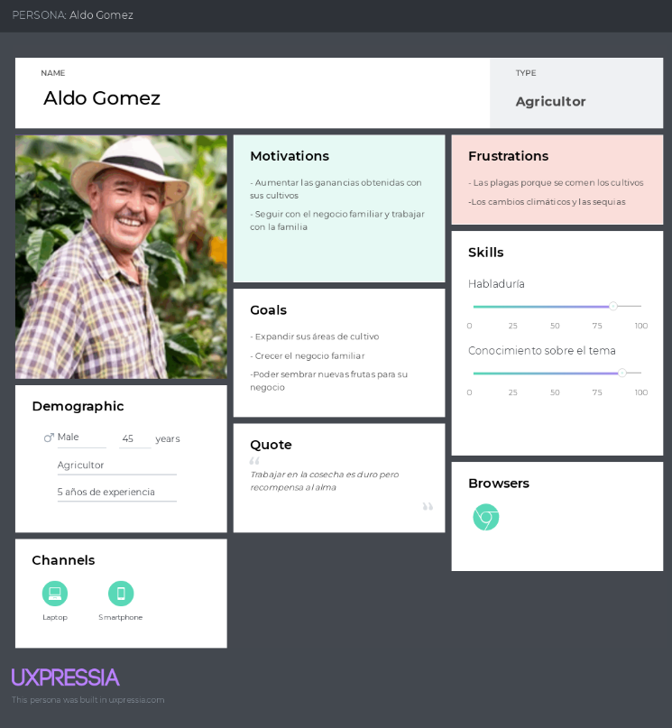
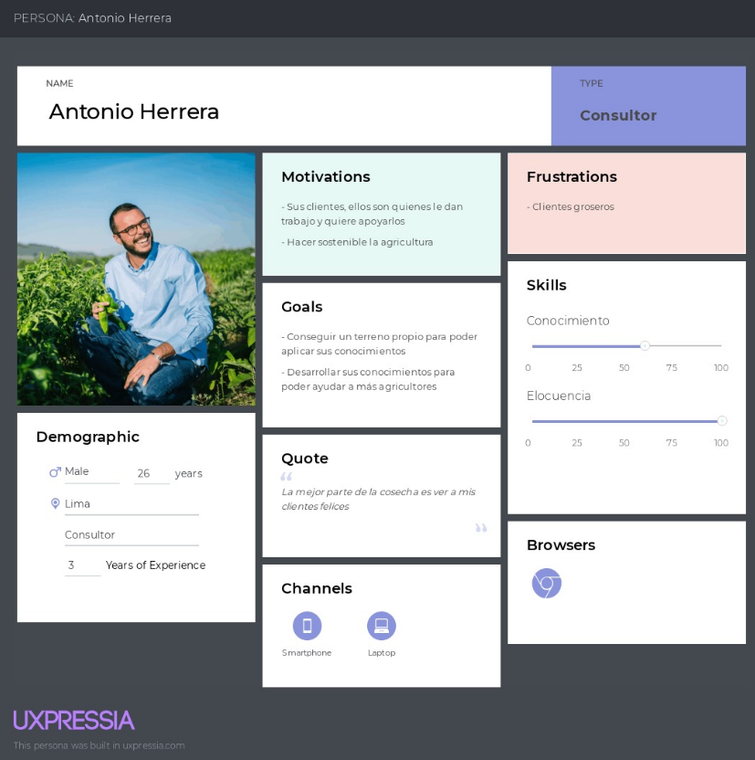

### 2.3.2 User Task Matrix
<table><tr><th rowspan="2" valign="top"><b><i>User task Matrix</i></b></th><th colspan="2" valign="top"><b><i>Aldo Gomez</i></b></th><th colspan="2" valign="top"><b><i>Antonio Herrera</i></b></th></tr>
<tr><td valign="top"><b><i>Frecuencia</i></b></td><td valign="top"><b><i>Importancia</i></b></td><td valign="top"><b><i>Frecuencia</i></b> </td><td valign="top"><b><i>Importancia</i></b></td></tr>
<tr><td>planificar el cultivo de la temporada</td><td><b><i>media</i></b></td><td><b><i>alta</i></b></td><td><b><i>alta</i></b></td><td><b><i>alta</i></b></td></tr>
<tr><td>comunicarse contrabajadores</td><td><b><i>media</i></b></td><td><b><i>alta</i></b></td><td><b><i>alta</i></b></td><td><b><i>alta</i></b></td></tr>
<tr><td>seguimiento de cultivos</td><td><b><i>alta</i></b></td><td><b><i>alta</i></b></td><td><b><i>alta</i></b></td><td><b><i>alta</i></b></td></tr>
<tr><td>Revision de pronostico del clima</td><td><b><i>alta</i></b></td><td><b><i>media</i></b></td><td><b><i>alta</i></b></td><td><b><i>alta</i></b></td></tr>
<tr><td>riego de plantas </td><td><b><i>media</i></b></td><td><b><i>alta</i></b></td><td><b><i>alta</i></b></td><td><b><i>alta</i></b></td></tr>
<tr><td>Identificación de pestes</td><td><b><i>baja</i></b></td><td><b><i>alta</i></b></td><td><b><i>alta</i></b></td><td><b><i>alta</i></b></td></tr>
<tr><td>peaje de cosechas</td><td><b><i>baja</i></b></td><td><b><i>alta</i></b></td><td><b><i>baja</i></b></td><td><b><i>alta</i></b></td></tr>
</table>

### 2.3.3 User Journey Mapping
**Segmento 1: Agricultores y pymes agrícolas**  
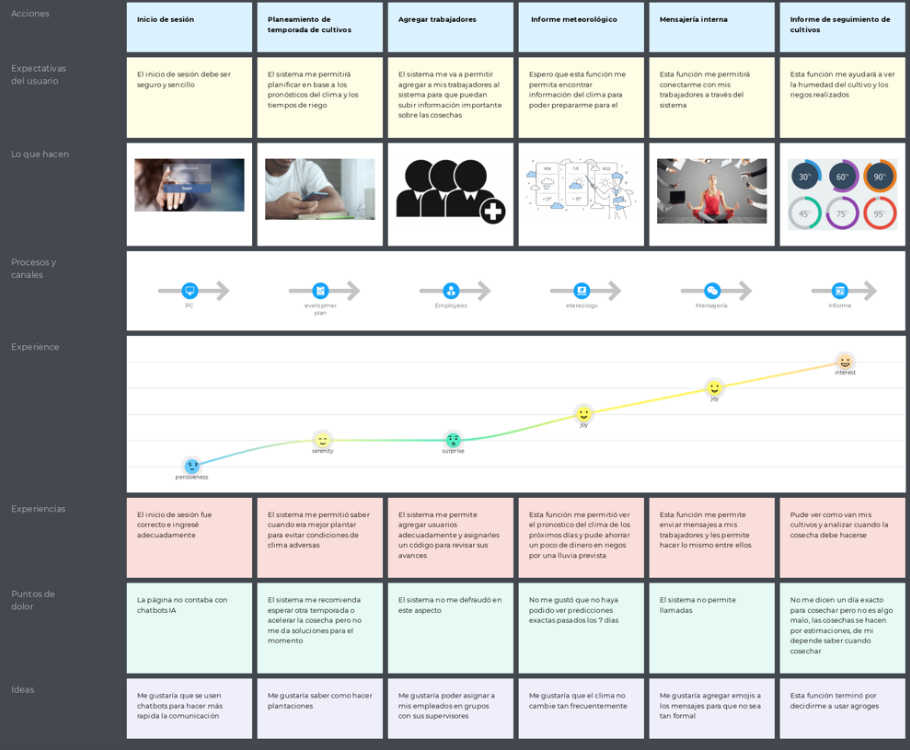  
**Segmento 2: Consultores agrícolas**  
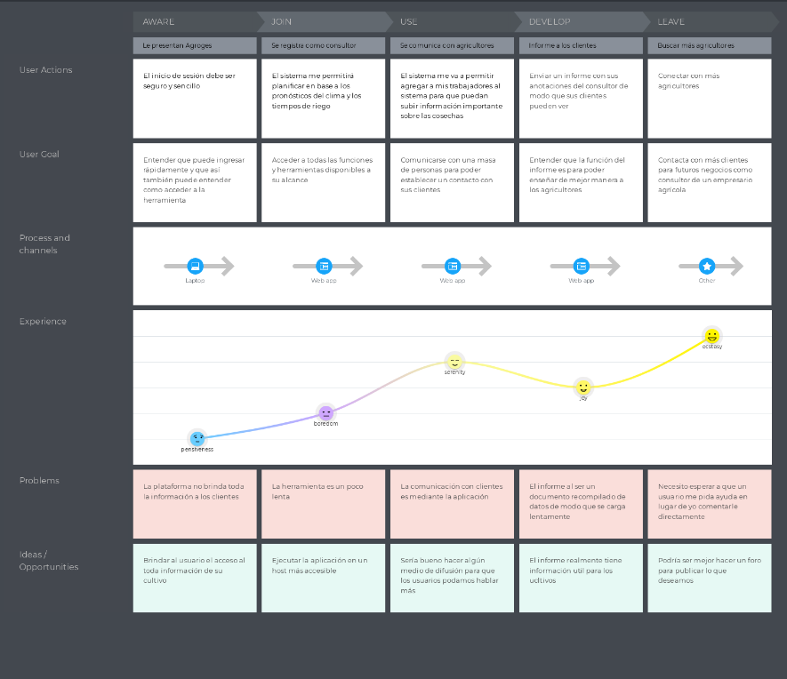

### 2.3.4 Empathy Mapping
**Segmento 1: Agricultores y pymes agrícolas**  
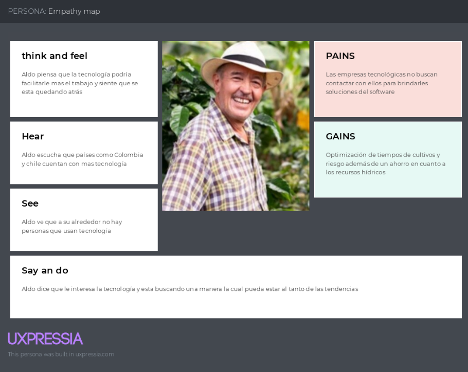  
**Segmento 2: Consultores agrícolas**  
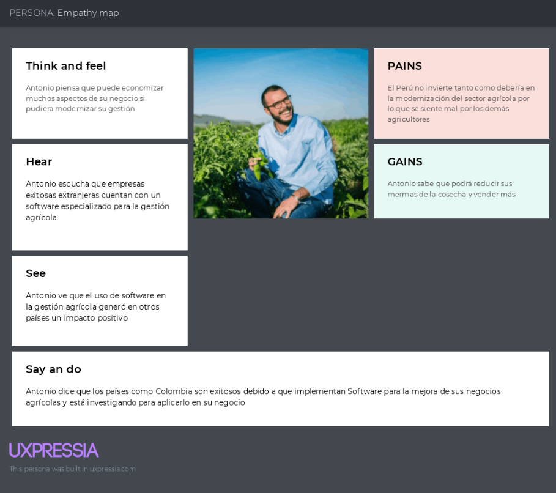

### 2.3.5 As-is Scenario Mapping
**Segmento 1: Agricultores y pymes agrícolas**  
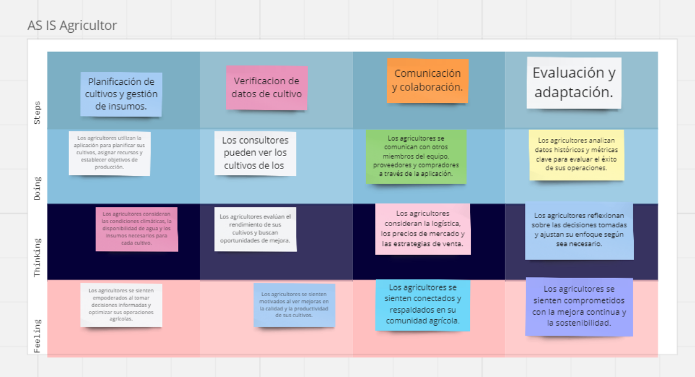
**Segmento 2: Consultores agrícolas**  
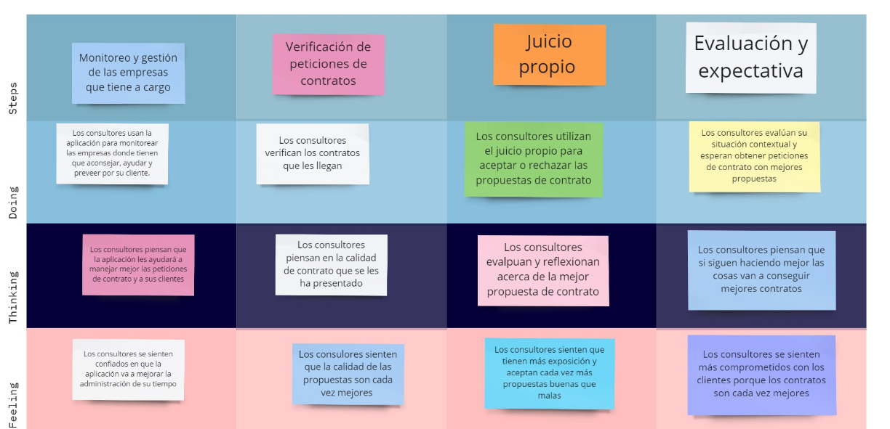

## 2.4 Ubiquitous Language
Ubiquitous language o lenguaje ubicuo hace referencia al lenguaje que puede ser entendido en cualquier parte, esta sección tiene como intención permitirle a personas sin vocabulario de un Ingeniero de software puedan entender. A continuación, mostraremos un glosario con contenido de este proyecto:
<ul>
  <li> Crop: El significado literal es cultivo y usaremos el término como entidad, servicio y componente durante el desarrollo del código. </li>
  <li> Employee: Significa empleado y lo estaremos usando para realizar entidades, servicios y componentes. </li>
  <li> Harvest: El proceso de recoger cultivos madurados de los campos de cultivo. </li>
  <li> Irrigation: La aplicación artificial de agua a la tierra para ayudar en la producción de cultivos. </li>
  <li> Fertilizer: Sustancias que se aplican al suelo del cultivo para incrementar su fertilidad y rendimiento. </li>
  <li> Pesticide: Son químicos utilizados para controlar, repeler y/o eliminar pestes del cultivo. </li>
  <li> Crop rotation: Es la práctica de cultivar diferentes tipos de plantas al mismo tiempo en el mismo área en estaciones secuenciales. </li>
  <li> Fumigation: Es un método de control de pestes o de eliminar microorganismos dañinos en un área específico mediante gases pesticidas. </li>
  <li> Germination: Significa el comienzo del crecimiento, ya sea de una semilla, espora o brote, en respuesta a la temperatura correcta y agua. </li>
</ul>

---

# Capítulo III: Requirements Specification
## 3.1 To-Be Scenario Mapping
**Segmento 1: Agricultores y pymes agrícolas**  
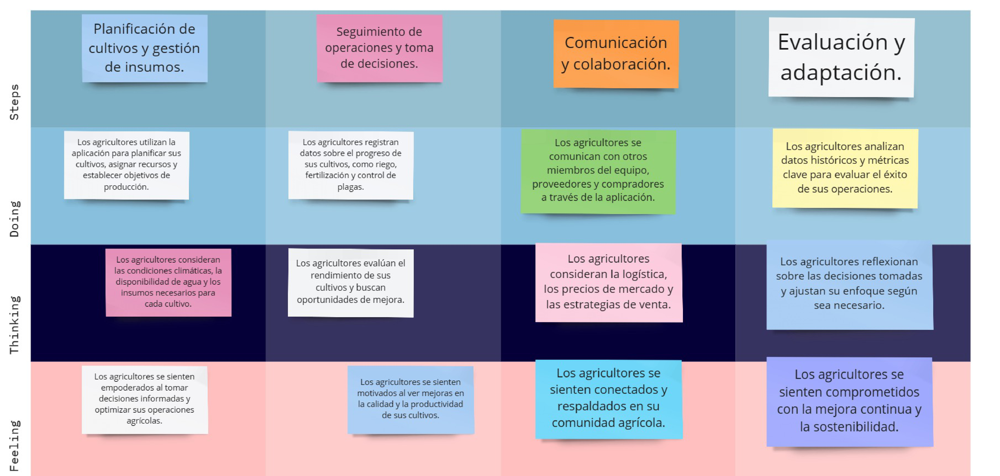
**Segmento 2: Consultores agrícolas**  

## 3.2 User Stories
| **ID** | **Título** | **Descripción** | **Criterios de Aceptación** | **Relacionado con (Epic ID)** |
|--------|-----------|-----------------|-----------------------------|---------------------------------|
| EPIC001 | Mejora de la Productividad | Como agricultor, deseo mejorar la productividad de mis cultivos. | | |
| EPIC002 | Control de Calidad | Como agricultor, deseo asegurar la calidad de mis productos. | | |
| EPIC003 | Prevención de Amenazas | Como agricultor, deseo prevenir amenazas a mis cultivos. | | |
| EPIC004 | Asesoramiento en Mejora de Productividad | Como consultor agrícola, deseo proporcionar asesoramiento especializado a los agricultores para mejorar su productividad. | ||
| EPIC005 | Asesoramiento en Control de Calidad y Prevención de Amenazas | Como consultor agrícola, quiero proporcionar asesoramiento especializado a los agricultores para mejorar la calidad de sus productos y prevenir amenazas. |||
| EPIC006 | Landing Page | Como visitante, quiero poder navegar por la página de inicio para obtener una visión general de lo que la plataforma ofrece y cómo puede beneficiarme. |||
| EPIC007 | Desarrollo de una API REST para la gestión de la agricultura | como equipo queremos tener una API REST completa para que me permita gestionar eficientemente todas las operaciones agrícolas de los agricultores o empresas . |||
| US001 | Definir Objetivos de Rendimiento | Como agricultor, quiero definir objetivos de rendimiento para mis cultivos para poder medir y mejorar mi productividad. | 1. Dado que estoy en la sección de definición de objetivos, cuando ingreso los objetivos en el sistema, entonces el sistema registra mis objetivos de rendimiento. 2. Dado que he definido los objetivos de rendimiento, cuando consulto los objetivos, entonces el sistema muestra los objetivos de rendimiento que he definido. 3. Dado que he definido los objetivos de rendimiento, cuando realizo seguimiento de los objetivos, entonces el sistema muestra el progreso hacia los objetivos de rendimiento. | EPIC001 |
| US002 | Adaptar Estrategia de Cultivo | Como agricultor, quiero adaptar mi estrategia de cultivo según los cambios en el entorno o las condiciones climáticas para poder maximizar la productividad de mis cultivos. | 1. Dado que estoy en la sección de estrategia de cultivo, cuando realizo cambios en mi estrategia en el sistema, entonces el sistema registra mi estrategia de cultivo adaptada. 2. Dado que he adaptado mi estrategia de cultivo, cuando consulto mi estrategia, entonces el sistema muestra la estrategia de cultivo que he adaptado. 3. Dado que he adaptado mi estrategia de cultivo, cuando realizo seguimiento de mi estrategia, entonces el sistema muestra el impacto de la estrategia adaptada en la productividad de los cultivos. | EPIC001 |
| US003 | Seguimiento de Actividades Agrícolas | Como agricultor, quiero realizar un seguimiento detallado de las actividades agrícolas diarias para poder analizar y optimizar mis procesos. | 1. Dado que estoy en la sección de seguimiento de actividades, cuando registro mis actividades en el sistema, entonces el sistema registra mis actividades agrícolas. 2. Dado que he registrado mis actividades agrícolas, cuando consulto mis actividades, entonces el sistema muestra un resumen de las actividades agrícolas que he realizado. 3. Dado que he registrado mis actividades agrícolas, cuando analizo mis actividades, entonces el sistema proporciona análisis y recomendaciones para optimizar los procesos agrícolas. | EPIC001 |
| US004 | Monitoreo de Calidad de Productos | Como agricultor, quiero monitorear la calidad de mis productos para asegurarme de que cumplen con los estándares requeridos. | 1. Dado que estoy en la sección de monitoreo de calidad, cuando registro los datos de calidad en el sistema, entonces el sistema registra la calidad de mis productos. 2. Dado que he registrado los datos de calidad de mis productos, cuando consulto los datos de calidad, entonces el sistema muestra los datos de calidad de mis productos. 3. Dado que he registrado los datos de calidad de mis productos, cuando comparo los datos de calidad con los estándares requeridos, entonces el sistema me proporciona un informe de cumplimiento de los estándares de calidad. | EPIC002 |
| US005 | Acceso a Mejores Prácticas Agrícolas | Como agricultor, quiero tener acceso a información actualizada sobre las mejores prácticas agrícolas para mejorar la calidad de mis productos. | 1. Dado que estoy en la sección de mejores prácticas agrícolas, cuando consulto esta información en el sistema, entonces el sistema me proporciona información actualizada sobre las mejores prácticas agrícolas. 2. Dado que he consultado información sobre las mejores prácticas agrícolas, cuando aplico estas prácticas, entonces el sistema registra las prácticas agrícolas que he aplicado. 3. Dado que he aplicado las mejores prácticas agrícolas, cuando realizo seguimiento de la calidad de mis productos, entonces el sistema muestra el impacto de las mejores prácticas agrícolas en la calidad de mis productos. | EPIC002 |
| US006 | Predicción y Prevención de Amenazas | Como agricultor, quiero predecir y prevenir posibles amenazas a mis cultivos para reducir las pérdidas. | 1. Dado que estoy en la sección de predicción de amenazas, cuando consulto estas amenazas en el sistema, entonces el sistema me permite predecir posibles amenazas a mis cultivos. 2. Dado que he predicho posibles amenazas a mis cultivos, cuando tomo medidas para prevenir estas amenazas, entonces el sistema registra las acciones que he tomado para prevenir las amenazas predichas. 3. Dado que he tomado medidas para prevenir las amenazas predichas, cuando realizo seguimiento de la salud de mis cultivos, entonces el sistema muestra el impacto de las medidas preventivas en la salud de mis cultivos. | EPIC003 |
| US007 | Recepción de Alertas Climáticas | Como agricultor, quiero recibir alertas sobre condiciones climáticas adversas para poder tomar medidas preventivas y proteger mis cultivos. | 1. Dado que el sistema detecta condiciones climáticas adversas, cuando recibo alertas del sistema, entonces el sistema me envía alertas. 2. Dado que he recibido alertas climáticas, cuando tomo medidas preventivas, entonces el sistema registra las medidas preventivas que he tomado. 3. Dado que he tomado medidas preventivas, cuando realizo seguimiento de la salud de mis cultivos, entonces el sistema muestra el impacto de las medidas preventivas en la salud de mis cultivos. | EPIC003 |
| US008 | Asesoramiento en Objetivos de Rendimiento | Como consultor agrícola, quiero asesorar a los agricultores en la definición de objetivos de rendimiento para sus cultivos. | 1. Dado que estoy en la sección de asesoramiento, cuando proporciono asesoramiento sobre la definición de objetivos de rendimiento, entonces el sistema registra el asesoramiento que he proporcionado. 2. Dado que he proporcionado asesoramiento, cuando el agricultor consulta el asesoramiento, entonces el sistema muestra el asesoramiento que he proporcionado. 3. Dado que he proporcionado asesoramiento, cuando el agricultor aplica el asesoramiento, entonces el sistema registra el impacto del asesoramiento en los objetivos de rendimiento del agricultor. | EPIC004 |
| US009 | Asesoramiento en Estrategias de Cultivo | Como consultor agrícola, quiero asesorar a los agricultores en la adaptación de su estrategia de cultivo según los cambios en el entorno o las condiciones climáticas. | 1. Dado que estoy en la sección de asesoramiento, cuando proporciono asesoramiento sobre la adaptación de estrategias de cultivo, entonces el sistema registra el asesoramiento que he proporcionado. 2. Dado que he proporcionado asesoramiento, cuando el agricultor consulta el asesoramiento, entonces el sistema muestra el asesoramiento que he proporcionado. 3. Dado que he proporcionado asesoramiento, cuando el agricultor aplica el asesoramiento, entonces el sistema registra el impacto del asesoramiento en la estrategia de cultivo del agricultor. | EPIC004 |
| US010 | Asesoramiento en Control de Calidad | Como consultor agrícola, quiero asesorar a los agricultores en el monitoreo de la calidad de sus productos. | 1. Dado que estoy en la sección de asesoramiento, cuando proporciono asesoramiento sobre el control de calidad, entonces el sistema registra el asesoramiento que he proporcionado. 2. Dado que he proporcionado asesoramiento, cuando el agricultor consulta el asesoramiento, entonces el sistema muestra el asesoramiento que he proporcionado. 3. Dado que he proporcionado asesoramiento, cuando el agricultor aplica el asesoramiento, entonces el sistema registra el impacto del asesoramiento en la calidad de los productos del agricultor. | EPIC005 |
| US011 | Asesoramiento en Prevención de Amenazas | Como consultor agrícola, quiero asesorar a los agricultores en la predicción y prevención de posibles amenazas a sus cultivos. | 1. Dado que estoy en la sección de asesoramiento, cuando proporciono asesoramiento sobre la prevención de amenazas, entonces el sistema registra el asesoramiento que he proporcionado. 2. Dado que he proporcionado asesoramiento, cuando el agricultor consulta el asesoramiento, entonces el sistema muestra el asesoramiento que he proporcionado. 3. Dado que he proporcionado asesoramiento, cuando el agricultor aplica el asesoramiento, entonces el sistema registra el impacto del asesoramiento en la prevención de amenazas a los cultivos del agricultor. | EPIC005 |
| US012    | Explorar la Página de Inicio | Como visitante, quiero explorar la página de inicio para obtener una visión general del sitio web y sus secciones. | - Dado que soy un visitante, cuando ingreso a la página de inicio, entonces debo ver una breve descripción del propósito del sitio. - Dado que soy un visitante, cuando navego por la página de inicio, entonces debo encontrar enlaces o botones que dirijan a las diferentes secciones del sitio. - Dado que soy un visitante, cuando hago clic en un enlace de una sección, entonces debo ser llevado a la página correspondiente. | EPIC006 |
| US013    | Ver Información de Productos/Servicios | Como visitante, quiero ver información detallada sobre los productos o servicios ofrecidos para poder verificar si es lo que necesito. | - Dado que soy un visitante, cuando accedo a la página de un producto/servicio, entonces debo ver una descripción detallada, imágenes y detalles relevantes. - Dado que soy un visitante, cuando busco información sobre un producto/servicio, entonces debo encontrar la información fácilmente. - Dado que soy un visitante, cuando navego por la página de un producto/servicio, entonces debo poder regresar a la página de inicio con facilidad. | EPIC006 |
| US014    | Contactar al Equipo de Ventas | Como visitante interesado, quiero encontrar una forma de contactar al equipo de ventas. | - Dado que soy un visitante interesado, cuando busco información de contacto, entonces debo encontrar un formulario de contacto o información clara de contacto. - Dado que soy un visitante interesado, cuando lleno el formulario de contacto, entonces debo recibir una confirmación de que mi mensaje fue enviado correctamente. - Dado que soy un visitante interesado, cuando envío un mensaje al equipo de ventas, entonces debo recibir una respuesta dentro de las 24 horas. | EPIC006 |
| US015    | Explorar Testimonios o Casos de Éxito | Como visitante, quiero leer testimonios o casos de éxito para evaluar la confiabilidad del sitio. | - Dado que soy un visitante, cuando busco testimonios o casos de éxito, entonces debo encontrar testimonios reales o estudios de caso. - Dado que soy un visitante, cuando leo un testimonio o caso de éxito, entonces debo encontrar información relevante y convincente. - Dado que soy un visitante, cuando leo los testimonios o casos de éxito, entonces debo sentir confianza en el sitio y sus productos/servicios. | EPIC006 |

## 3.3 Impact Mapping
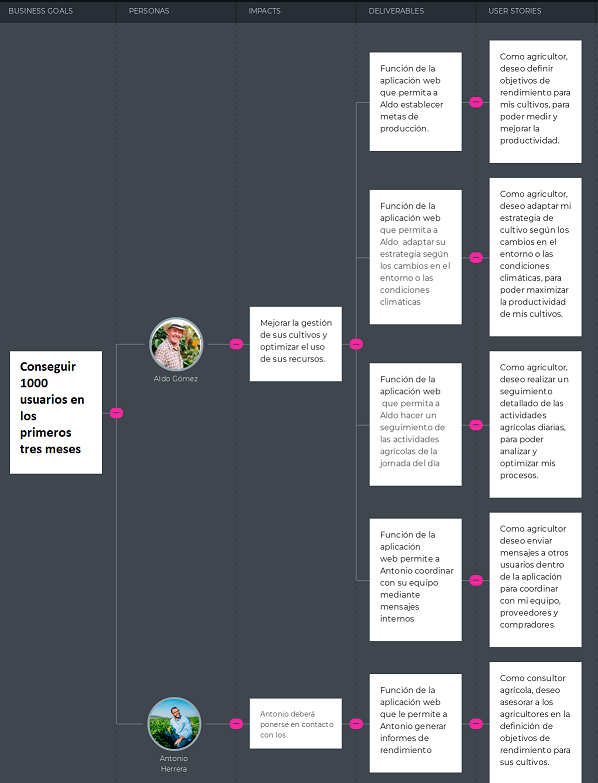  
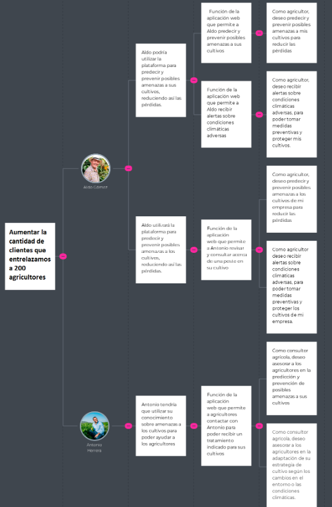  
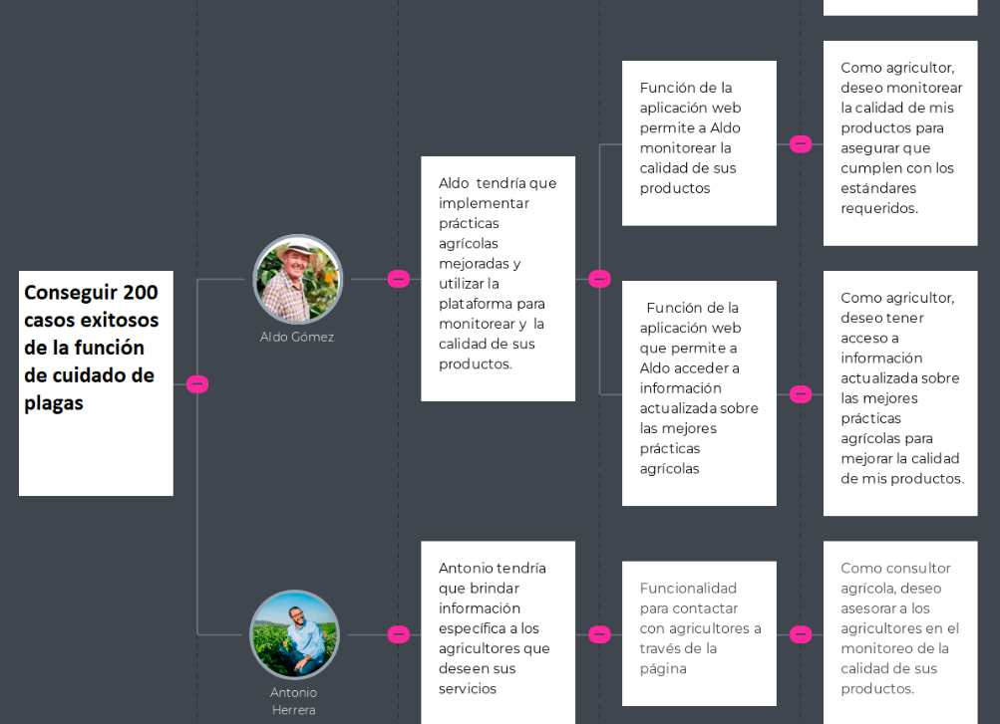  

## 3.4 Product Backlog

| **#Order** | **User Story Id** | **Título** | **Descripción** | **Story Points (1 / 2 / 3 / 5 / 8)** |
|------------|-------------------|------------|-----------------|---------------------------------------|
| 1 | US012 | Explorar la Página de Inicio | Como visitante, quiero explorar la página de inicio para obtener una visión general del sitio web y sus secciones. | 1 |
| 2 | US013 | Ver Información de Productos/Servicios | Como visitante, quiero ver información detallada sobre los productos o servicios ofrecidos. | 1 |
| 3 | US014 | Contactar al Equipo de Ventas | Como visitante interesado, quiero encontrar una forma de contactar al equipo de ventas. | 1 |
| 4 | US015 | Explorar Testimonios o Casos de Éxito | Como visitante, quiero leer testimonios o casos de éxito para evaluar la confiabilidad del sitio. | 1 |
| 5 | US001 | Definir Objetivos de Rendimiento | Como agricultor, quiero definir objetivos de rendimiento para mis cultivos para poder medir y mejorar mi productividad. | 3 |
| 6 | US002 | Adaptar Estrategia de Cultivo | Como agricultor, quiero adaptar mi estrategia de cultivo según los cambios en el entorno o las condiciones climáticas para poder maximizar la productividad de mis cultivos. | 3 |
| 7 | US003 | Seguimiento de Actividades Agrícolas | Como agricultor, quiero realizar un seguimiento detallado de las actividades agrícolas diarias para poder analizar y optimizar mis procesos. | 2 |
| 8 | US004 | Monitoreo de Calidad de Productos | Como agricultor, quiero monitorear la calidad de mis productos para asegurarme de que cumplen con los estándares requeridos. | 2 |
| 9 | US005 | Acceso a Mejores Prácticas Agrícolas | Como agricultor, quiero tener acceso a información actualizada sobre las mejores prácticas agrícolas para mejorar la calidad de mis productos. | 1 |
| 10 | US006 | Predicción y Prevención de Amenazas | Como agricultor, quiero predecir y prevenir posibles amenazas a mis cultivos para reducir las pérdidas. | 3 |
| 11 | US007 | Recepción de Alertas Climáticas | Como agricultor, quiero recibir alertas sobre condiciones climáticas adversas para poder tomar medidas preventivas y proteger mis cultivos. | 2 |
| 12 | US008 | Asesoramiento en Objetivos de Rendimiento | Como consultor agrícola, quiero asesorar a los agricultores en la definición de objetivos de rendimiento para sus cultivos. | 2 |
| 13 | US009 | Asesoramiento en Estrategias de Cultivo | Como consultor agrícola, quiero asesorar a los agricultores en la adaptación de su estrategia de cultivo según los cambios en el entorno o las condiciones climáticas. | 3 |
| 14 | US010 | Asesoramiento en Control de Calidad | Como consultor agrícola, quiero asesorar a los agricultores en el monitoreo de la calidad de sus productos. | 1 |	
| 15 | US011 | Asesoramiento en Prevención de Amenazas | Como consultor agrícola, quiero asesorar a los agricultores en la predicción y prevención de posibles amenazas a sus cultivos. | 3 |

---

# Capítulo IV: Product Design

---

# Capítulo V: Product Implementation, Validation & Deployment

---

# Conclusiones

## Video About-the-Team

# Bibliografía

# Anexos
