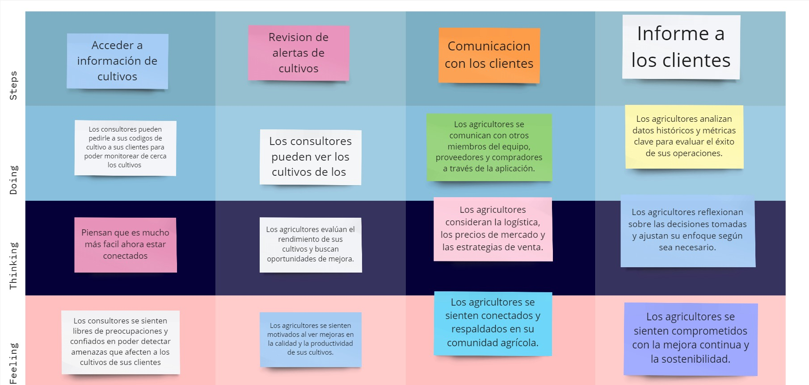
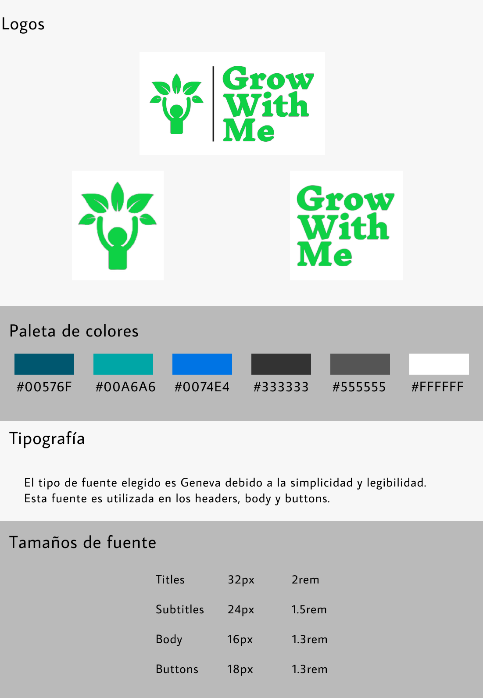
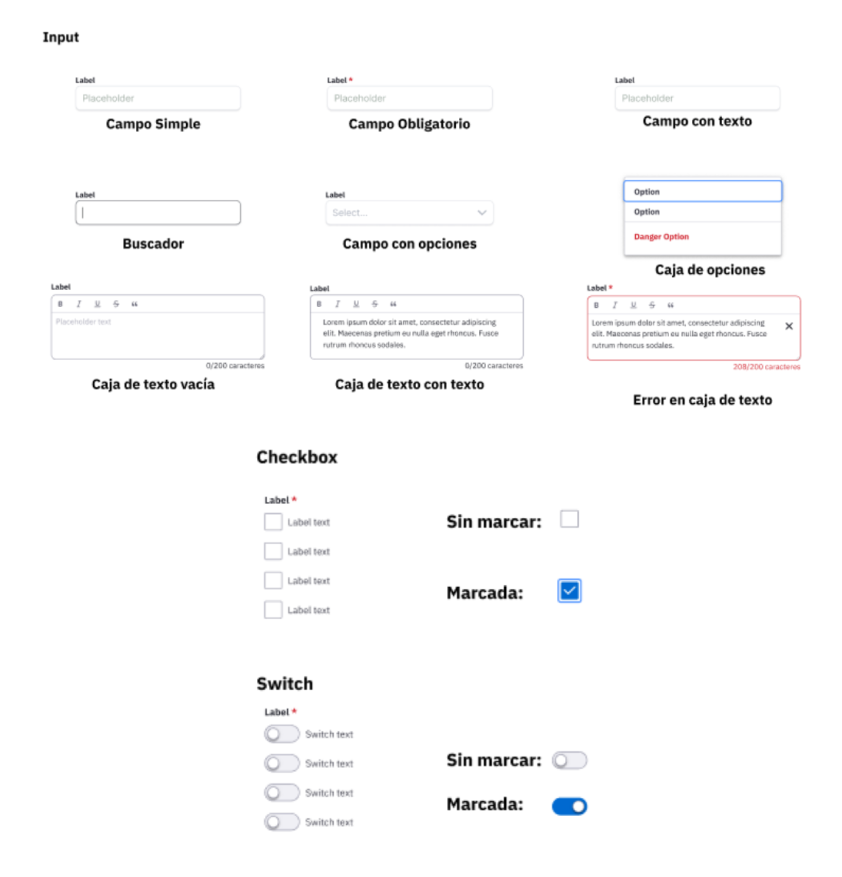
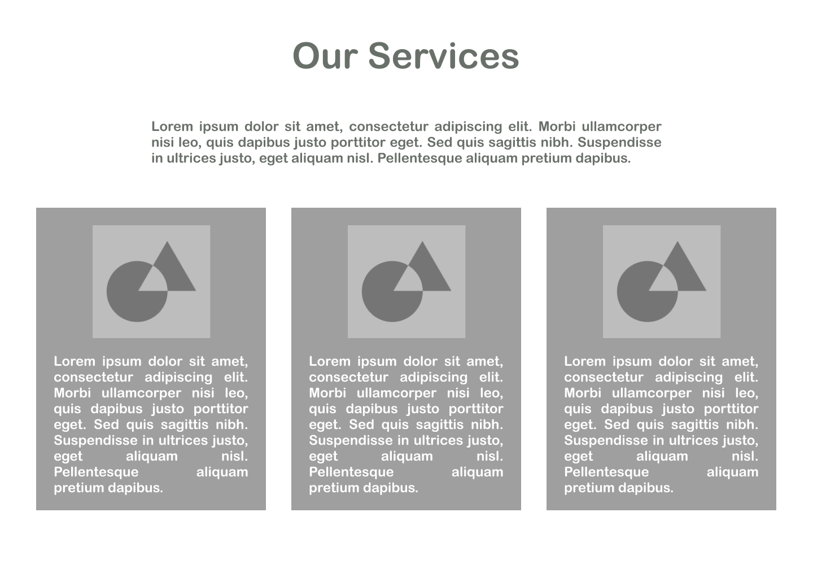
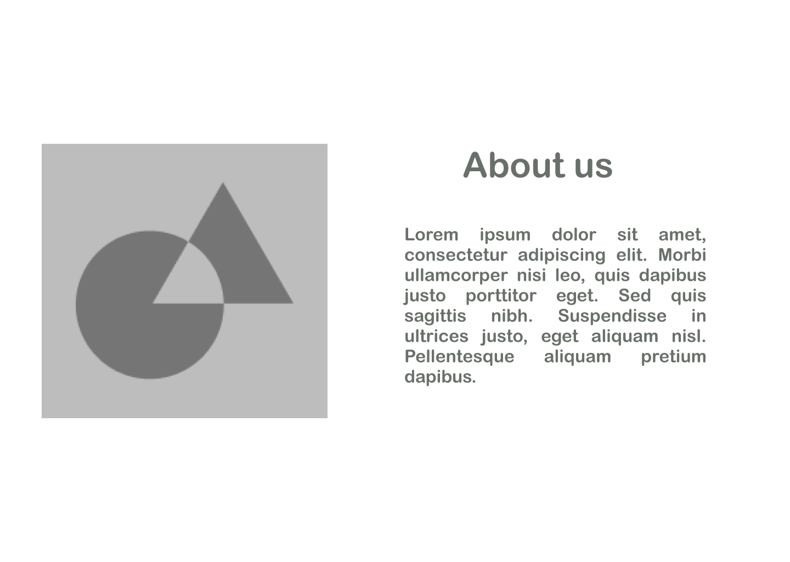
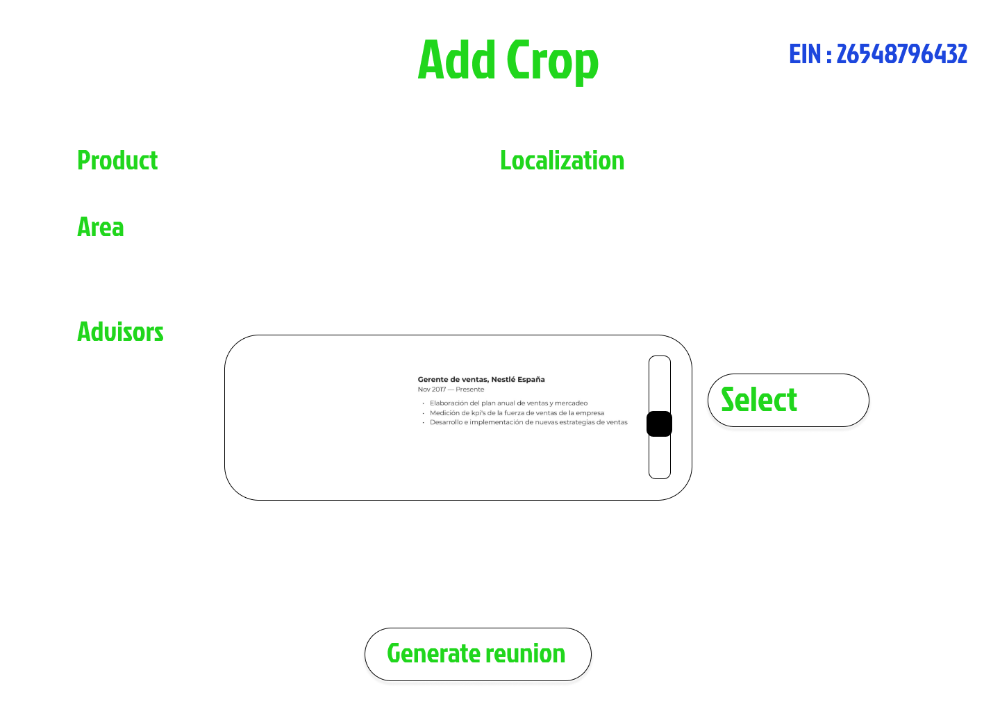
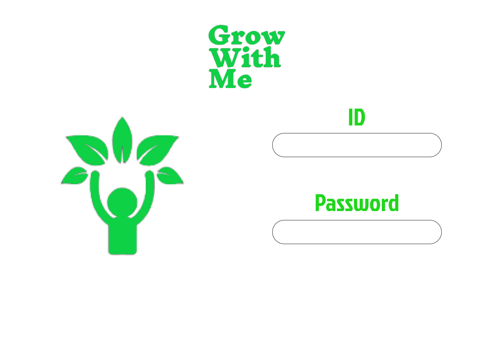

# 
 Universidad Peruana de Ciencias Aplicadas 

  

### 
 Informe de Trabajo Final 

 

  
 Carrera: Ingeniería de Software 

   
  
 Ciclo: 2024-2 

   
  
 Curso: Desarrollo de Aplicaciones Open Source 

   
  
 Sección: WX51 

   
  
 Profesor: Alberto Wilmer Sanchez Seña 

   
  
 Nombre del Startup: Cup of Tech 

   
  
 Nombre del Producto: Grow With Me 

   
  
 Relación de Integrantes: 

  
  - Alonso Garay, Diego Jesus (u20221d014) 

  
  - Briceño De La Cruz, Farid Sebastian (u20211f211) 

  
  - Landeo Simeón, Favio Sebastián (u202119588) 

  
  - Paucar Meneses, Jeremy Alion (u201719449) 

  
  - Rivera Ayala, Gabriel Alejandro (u202223279)

   
  
 Mes y Año: Agosto del 2024 

---

# Registro de Versiones del Informe

<table>
  <tr>
    <th style="text-align:center;">Versión</th>
    <th style="text-align:center;">Fecha</th>
    <th style="text-align:center;">Autor</th>
    <th style="text-align:center;">Descripción de la modificación</th>
  </tr>
  <tr>
    <td align="center">TB1</td>
    <td>07/09/2024</td>
    <td> Landeo Simeón, Favio Sebastián   Paucar Meneses, Jeremy Alion   Rivera Ayala, Gabriel Alejandro   Alonso Garay, Diego Jesus </td>
    <td> Realizamos los capítulos 1, 2, 3, 4 y 5 según la rúbrica de manera conjunta y eficiente.  </td>
  </tr>
  <tr>
    <td align="center">TP1</td>
    <td>07/09/2024</td>
    <td> Landeo Simeón, Favio Sebastián   Paucar Meneses, Jeremy Alion   Rivera Ayala, Gabriel Alejandro   Alonso Garay, Diego Jesus </td>
    <td> Se hizo la mejora continua según la retroalimentación en los User Stories agregando los Technical Stories, se mejoró el Sprint 1 y se agregó el Sprint 2  </td>
  </tr>
</table>

---

# Project Report Collaboration Insights

TB1: Las tareas asignadas para la entrega TB1 se han completado y están documentadas en el repositorio de Github.

- Se escribieron y diagramaron los contenidos asignados a cada miembro en formato Markdown, seguido de commits para asegurar el progreso en el repositorio.
- Se organizaron reuniones para coordinar el progreso de los elementos del informe y para comunicar los avances del Sprint 1.

TP1: Los features de esta entrega se han avanzado mas no completado al 100%. La Landing Page se encuentra desplegada en Netlify.

---

# Tabla de contenidos

- [ Universidad Peruana de Ciencias Aplicadas ](#-universidad-peruana-de-ciencias-aplicadas-)
    - [ Informe de Trabajo Final ](#-informe-de-trabajo-final-)
- [Registro de Versiones del Informe](#registro-de-versiones-del-informe)
- [Project Report Collaboration Insights](#project-report-collaboration-insights)
- [Tabla de contenidos](#tabla-de-contenidos)
- [Student Outcome](#student-outcome)
- [Capítulo I: Introducción](#capítulo-i-introducción)
  - [1.1 Startup Profile](#11-startup-profile)
    - [1.1.1 Descripción de la Startup](#111-descripción-de-la-startup)
    - [1.1.2 Perfiles de integrantes del equipo](#112-perfiles-de-integrantes-del-equipo)
  - [1.2 Solution Profile](#12-solution-profile)
    - [1.2.1 Antecedentes y problemática](#121-antecedentes-y-problemática)
    - [1.2.2 Lean UX Process](#122-lean-ux-process)
      - [1.2.2.1 Lean UX Problem Statements](#1221-lean-ux-problem-statements)
      - [1.2.2.2 Lean UX Assumptions](#1222-lean-ux-assumptions)
      - [1.2.2.3 Lean UX Hypothesis Statements](#1223-lean-ux-hypothesis-statements)
      - [1.2.2.4 Lean UX Canvas](#1224-lean-ux-canvas)
  - [1.3 Segmentos objetivo](#13-segmentos-objetivo)
- [Capítulo II: Requirements Elicitation \& Analysis](#capítulo-ii-requirements-elicitation--analysis)
  - [2.1 Competidores](#21-competidores)
    - [2.1.1 Análisis competitivo](#211-análisis-competitivo)
    - [2.1.2 Estrategias y tácticas frente a competidores](#212-estrategias-y-tácticas-frente-a-competidores)
  - [2.2 Entrevistas](#22-entrevistas)
    - [2.2.1 Diseño de entrevistas](#221-diseño-de-entrevistas)
    - [2.2.2 Registro de entrevistas](#222-registro-de-entrevistas)
    - [2.2.3 Análisis de entrevistas](#223-análisis-de-entrevistas)
  - [2.3 Needfinding](#23-needfinding)
    - [2.3.1 User Personas](#231-user-personas)
    - [2.3.2 User Task Matrix](#232-user-task-matrix)
    - [2.3.3 User Journey Mapping](#233-user-journey-mapping)
    - [2.3.4 Empathy Mapping](#234-empathy-mapping)
    - [2.3.5 As-is Scenario Mapping](#235-as-is-scenario-mapping)
  - [2.4 Ubiquitous Language](#24-ubiquitous-language)
- [Capítulo III: Requirements Specification](#capítulo-iii-requirements-specification)
  - [3.1 To-Be Scenario Mapping](#31-to-be-scenario-mapping)
  - [3.2 User Stories](#32-user-stories)
  - [3.3 Impact Mapping](#33-impact-mapping)
  - [3.4 Product Backlog](#34-product-backlog)
- [Capítulo IV: Product Design](#capítulo-iv-product-design)
  - [4.1 Style Guidelines](#41-style-guidelines)
    - [4.1.1 General Style Guidelines](#411-general-style-guidelines)
    - [4.1.2 Web Style Guidelines](#412-web-style-guidelines)
  - [4.2 Information Architecture](#42-information-architecture)
    - [4.2.1 Organization Systems](#421-organization-systems)
    - [4.2.2 Labeling Systems](#422-labeling-systems)
    - [4.2.3 SEO Tags and Meta Tags](#423-seo-tags-and-meta-tags)
    - [4.2.4 Searching Systems](#424-searching-systems)
    - [4.2.5 Navigation Systems](#425-navigation-systems)
  - [4.3 Landing Page UI Design](#43-landing-page-ui-design)
    - [4.3.1 Landing Page Wireframe](#431-landing-page-wireframe)
    - [4.3.2 Landing Page Mock-up](#432-landing-page-mock-up)
  - [4.4 Web Applications UX/UI Design](#44-web-applications-uxui-design)
    - [4.4.1 Web Applications Wireframes](#441-web-applications-wireframes)
    - [4.4.2 Web Applications Wireflow Diagrams](#442-web-applications-wireflow-diagrams)
    - [4.4.3 Web Applications Mock-ups](#443-web-applications-mock-ups)
    - [4.4.4 Web Applications User Flow Diagrams](#444-web-applications-user-flow-diagrams)
  - [4.5 Web Applications Prototyping](#45-web-applications-prototyping)
  - [4.6 Domain-Driven Software Architecture](#46-domain-driven-software-architecture)
    - [4.6.1 Software Architecture Context Diagram](#461-software-architecture-context-diagram)
    - [4.6.2 Software Architecture Container Diagrams](#462-software-architecture-container-diagrams)
    - [4.6.3 Software Architecture Components Diagrams](#463-software-architecture-components-diagrams)
  - [4.7 Software Object-Oriented Design](#47-software-object-oriented-design)
    - [4.7.1 Class Diagrams](#471-class-diagrams)
    - [4.7.2 Class Dictionary](#472-class-dictionary)
  - [4.8 Database Design](#48-database-design)
    - [4.8.1 Database Diagram](#481-database-diagram)
- [Capítulo V: Product Implementation, Validation \& Deployment](#capítulo-v-product-implementation-validation--deployment)
  - [5.1 Software Configuration Management](#51-software-configuration-management)
    - [5.1.1 Software Development Environment Configuration](#511-software-development-environment-configuration)
    - [5.1.2 Source Code Management](#512-source-code-management)
    - [5.1.3 Source Code Style Guide \& Conventions](#513-source-code-style-guide--conventions)
    - [5.1.4 Software Deployment Configuration](#514-software-deployment-configuration)
  - [5.2 Landing Page, Services \& Applications Implementation](#52-landing-page-services--applications-implementation)
    - [5.2.1 Sprint 1](#521-sprint-1)
      - [5.2.1.1. Sprint Planning 1](#5211-sprint-planning-1)
      - [5.2.1.2. Sprint Backlog 1](#5212-sprint-backlog-1)
      - [5.2.1.3. Development Evidence for Sprint Review](#5213-development-evidence-for-sprint-review)
      - [5.2.1.4. Testing Suite Evidence for Sprint Review](#5214-testing-suite-evidence-for-sprint-review)
      - [5.2.1.5. Execution Evidence for Sprint Review](#5215-execution-evidence-for-sprint-review)
      - [5.2.1.6. Services Documentation Evidence for Sprint Review](#5216-services-documentation-evidence-for-sprint-review)
      - [5.2.1.7. Software Deployment Evidence for Sprint Review](#5217-software-deployment-evidence-for-sprint-review)
      - [5.2.1.8. Team Collaboration Insights during Sprint](#5218-team-collaboration-insights-during-sprint)
- [Conclusiones](#conclusiones)
  - [Video About-the-Team](#video-about-the-team)
- [Bibliografía](#bibliografía)
- [Anexos](#anexos)

---

# Student Outcome

**ABET – EAC - Student Outcome 3**
Capacidad de comunicarse efectivamente con un rango de audiencias.  

<table>
    <tr>
        <th style="text-align:center;">Criterio específico</th>
        <th style="text-align:center;">Acciones realizadas</th>
        <th style="text-align:center;">Conclusiones</th>
    </tr>
    <tr>
        <td align="center">Comunica oralmente con efectividad a diferentes rangos de audiencia.</td>
        <td>
<strong> Alonso Garay, Diego Jesus </strong>  
TB1   En esta entrega, aprendí a comunicarme de manera oral con mi equipo mediante reuniones para cumplir con la fecha límite, demostrando tanto eficacia como compañerismo.
 
TP1   Para esta entrega aprendí a ser más asertivo en la comunicación para terminar el sprint 2 y el frontend con éxito.
 
 
<strong> Briceño De La Cruz, Farid Sebastian </strong>  

TB1   Para esta entrega reforcé las habilidades orales de equipo que aprendí en cursos anteriores.
 
TP1   Apliqué la comunicación efectiva para terminar el sprint 2 y los componentes del proyecto frontend.

 
 
<strong> Landeo Simeón, Favio Sebastián </strong>  
TB1   Aprendí en esta entrega a comunicarme oralmente con mi equipo para cumplir con la fecha límite, demostrando eficacia y compañerismo.
  
TP1   Apliqué la comunicación para realizar los puntos señalados en la retroalimentación del profesor y en el sprint 2.
           
 
<strong> Paucar Meneses, Jeremy Alion </strong>  
TB1   En esta entrega, aprendí a comunicarme de manera oral con mi equipo para cumplir con la fecha límite, demostrando tanto eficacia como compañerismo.
  
TP1   En esta entrega aprendí a ser mejor con las palabras para terminar exitosamente el proyecto frontend y el sprint 2.
 
 
<strong> Rivera Ayala, Gabriel Alejandro </strong>  
TB1   En esta engrega, pude comunicar mis opiniones dentro del equipo y coordinar la elaboración de los contenidos asignados.
 
TP1
 
En esta entrega, pude cooperar y coordinar dentro del equipo para desarrollar una aplicación web alineada con nuestros objetivos.
        </td>
        <td>
        TB1: Concluimos que para la TB1 aplicamos el compañerismo y la buena comunicación oral para completar la entrega respectiva. 
         
        TP1: Concluimos que para esta entrega desarrollamos mejor la habilidad de comunicación oral para expresar las mejoras y la retroalimentación del profesor.
        </td>
    </tr>
    <tr>
        <td align="center">Comunica por escrito con efectividad a diferentes rangos de audiencia</td>
        <td>
          <strong> Alonso Garay, Diego Jesus </strong>  
          TB1   En esta entrega, aprendí a comunicarme por escrito mediante Whatsapp con mi grupo para llegar a un acuerdo donde podamos realizar conjuntamente el proyecto.
           
	  TP1   Apliqué los mensajes de texto y reuniones de voz para comunicar los avances que ibamos realiazando para los endpoints y correcciones del informe.
           
           
          <strong> Briceño De La Cruz, Farid Sebastian </strong>  
          TB1   Apliqué la comunicación escrita con mis compañeros en la realización del tb1.
           
          TP1   Apliqué la comunicación por medio del chat efectiva para terminar el sprint 2 y los componentes del proyecto frontend.
           
	  TP   En el tp recibí apoyo de mis compañeros para poder lograr los objetivos del equipo.
           
	   
          <strong> Landeo Simeón, Favio Sebastián </strong>  
          TB1   Aprendí a comunicarme por escrito mediante Whatsapp con mi grupo para llegar a un acuerdo donde podamos realizar conjuntamente el proyecto.
            
          TP1   Apliqué los mensajes de texto para comunicar y ayudar a dividir los avances en los puntos señalados en la retroalimentación del profesor y en el sprint 2.
           
           
          <strong> Paucar Meneses, Jeremy Alion </strong>  
          TB1   En esta entrega, pude ayudar con efectividad a mi grupo con los diferentes objetivos que cubre el trabajo.
           
          TP1   En esta TP1 pude expresar por medio del chat grupal mis soluciones para el sprint 2 y los componentes del frontend.
           
          <strong> Rivera Ayala, Gabriel Alejandro </strong>  
          TB1   En esta entrega, pude comunicar sobre mis avances en el proyecto a mis compañeros de forma clara y efectiva, facilitando el desarrollo.
           
          TP 
           
          En esta entrega, pude aplicar GitFlow y conventional commits para dar a conocer a mi equipo los cambios que realizé en el proyecto. 
        </td>
        <td>
        TB1: Concluimos que para esta TB1 desarrollamos el proyecto con una gran efectividad al momento de comunicarnos por escrito.
         
        TP1: Concluimos que para esta entrega aplicamos mucho mejor la comunicación escrita para dividirnos los features y acabar con efectividad.
         </td>
    </tr>
</table>

---

# Capítulo I: Introducción

## 1.1 Startup Profile

Nuestro proyecto se centra en proporcionar una solución que optimice la gestión de productos agrícolas, mejore la calidad de la producción y facilite las operaciones para los productores en la industria agrícola.

### 1.1.1 Descripción de la Startup

Nuestro proyecto agrícola surge de la identificación de una necesidad insatisfecha en la gestión de productos agrícolas ya que los agrícolas enfrentan desafíos en la gestión de sus productos y operaciones, por lo que hemos visto una oportunidad para aplicar este software y así mejorar la eficiencia y la calidad en las operaciones para los productores agrícolas.

### 1.1.2 Perfiles de integrantes del equipo

#### - Favio Sebastián Landeo Simeón

Mi nombre es Favio, tengo 20 años y actualmente estoy cursando el séptimo ciclo de la carrera de Ingeniería de Software. Estoy disponible para ayudar siempre a mis compañeros y además tiendo a generar buenas relaciones sociales con diferentes tipos de personas gracias a mi tolerancia y capacidad de trabajo en equipo. Tengo experiencia en los lenguajes de programación C++ y Python. En mis tiempos libres me gusta escuchar música, jugar videojuegos y editar videos.

#### - Jeremy Alión Paucar Meneses

Mi nombre es Jeremy, Tengo 22 años. En la actualidad estoy estudiando la carrera de ingeniería de software en la Universidad Peruana de Ciencias Aplicadas. Albergo conocimientos intermedios en algunos lenguajes de programación, tales como C++, JavaScript y Python. Me considero una persona responsable con disposición de apoyar al grupo, también me gustan mucho los retos y así mismo poder cumplirlos.

#### - Alonso Garay, Diego Jesus

Mi nombre es Diego Jesus Alonso Garay y tengo 21 años. Soy estudiante de la carrera de Ingeniería de Software en la Universidad Peruana de Ciencias Aplicadas (UPC) y actualmente estoy en el quinto ciclo. Me considero una persona intuitiva y busco siempre ver el lado positivo de las cosas, pero siempre con los pies sobre la tierra. Tengo conocimiento en el uso de programas de edición como Photoshop y también sobre el uso básico de lenguajes de programación. Por lo general siempre busco dar lo necesario para realizar un buen trabajo, y en este curso estaré al pendiente de cualquier responsabilidad para realizar correctamente el presente proyecto.

### - Briceño De La Cruz, Farid Sebastian

### - Rivera Ayala, Gabriel Alejandro

Soy estudiante de Ingeniería de Software. Me interesa el aprendizaje continuo en todo lo relacionado al desarrollo de aplicaciones interactivas. He desarrollado proyectos en C++, Python, HTML y CSS. Actualmente estoy aprendiendo a realizar aplicaciones web usando el framework Angular y Vue. Me considero una persona trabajadora y apoyaré a mis compañeros a realizar un buen trabajo.

## 1.2 Solution Profile

Se encuentra compuesta por 2 secciones:

- Antecedentes y Problemática: Esta sección describe el problema que el proyecto tiene como objetivo resolver. En este se incluyen el enunciado del problema, una descripción de los puntos más importantes que debe resolver la solución, los objetivos y restricciones del proyecto.

- Lean UX Process: Esta sección aplica el Lean UX Process y describe de manera detallada cómo se resolverá el problema mediante el modelo de negocio.

### 1.2.1 Antecedentes y problemática

### Antecedentes

-Creciente demanda de alimentos debido al aumento de la población mundial.

-Necesidad de aumentar la productividad agrícola para satisfacer esta demanda.

-Desafíos asociados con el cambio climático y la sostenibilidad.

-Dificultad para monitorear y optimizar el crecimiento de los cultivos.

-Preocupaciones sobre la calidad y seguridad de los productos.

### Problemática (5Ws y 2Hs)

### What/Qué

#### ¿Cuál es el problema?

La gestión de productos agrícolas y la optimización de operaciones para productores en la industria agrícola.

### Where / Dónde

#### ¿Dónde está el usuario cuando usa el producto?

En áreas rurales y regiones agrícolas, campos de cultivos o huertas.

#### ¿Dónde surge el problema?

En las grandes y pequeñas empreas agricolas , asi como agricolas independientes.

### Why / Por Qué

#### ¿Cuál es la causa del problema?

Debido a la creciente demanda de alimentos, la necesidad de aumentar la productividad agrícola y los desafíos asociados con el cambio climático y la sostenibilidad.

### When / Cuándo

#### ¿Cuándo sucede el problema?

Cuando la población mundial está en constante crecimiento y la presión sobre la producción agrícola es cada vez mayor debido a factores como el cambio climático

### Who / Quién

#### ¿Quiénes están involucrados?

Productores agrícolas, empresas grandes y pequeñas del sector agroindustrial.

### How / Cómo

#### ¿En qué condiciones los usuarios usan nuestro producto?

Utilizando celulares, tablets, donde tienen colaboraciones con expertos en agricultura y desarrollo de soluciones personalizadas.

#### ¿Cómo nos conoceran los usuarios?

Los usuarios pueden conocer nuestra plataforma a través de diversas vías. Algunas de las más comunes incluyen:

- Boca a boca: La recomendación de amigos, familiares o colegas que ya han utilizado la plataforma y han tenido experiencias positivas.
- Redes sociales: Publicaciones, anuncios o menciones en plataformas como Facebook, Twitter, Instagram, entre otras.
- Colaboraciones con influencers: Asociaciones con figuras prominentes en el mundo de la literatura y el arte que promueven la plataforma a sus seguidores.

### How much / Cuánto

El impacto económico puede variar según el alcance y la implementación de las soluciones propuestas, pero el potencial de mejora en eficiencia y calidad es significativo.

### 1.2.2 Lean UX Process

#### 1.2.2.1 Lean UX Problem Statements

El desafío de los agricultores esta en la monitorización del crecimiento de cultivos, ya que la falta de herramientas efectivas para monitorear el crecimiento de los cultivos dificulta la identificación temprana de problemas, como condiciones climáticas adversas, lo que resulta en pérdidas de cosechas y disminución de la calidad de los productos, por otro lado Los productores agrícolas luchan por optimizar sus operaciones debido a la falta de herramientas, desde la planificación de cultivos hasta la gestión de la mano de obra y la logística, lo que limita su capacidad para aumentar la eficiencia y la productividad

#### 1.2.2.2 Lean UX Assumptions

#### Features

- Herramientas de monitorización del crecimiento de cultivos: Sensores agrícolas para recopilar datos sobre condiciones ambientales, humedad del suelo, y salud de los cultivos.
- Plataforma integrada de gestión agrícola: Suite de herramientas que abarca la planificación de cultivos, gestión de la mano de obra, monitoreo de inventario, programación de riego, y seguimiento de costos y funcionalidades de análisis de datos para identificar áreas de mejora y optimizar la eficiencia operativa en todas las etapas de la producción agrícola.

#### Business Outcomes

- Mejora de la eficiencia operativa: Reducción de los tiempos de inactividad y los costos asociados con la gestión manual de inventario y la resolución de problemas en la cadena de suministro y optimización de los procesos agrícolas mediante la automatización y la aplicación de datos en tiempo real para la toma de decisiones.

- Aumento de la rentabilidad: Reducción de las pérdidas debido a errores en la gestión de inventario, enfermedades de cultivos no detectadas y problemas logísticos y mejora de la productividad y la calidad de los productos agrícolas, lo que puede traducirse en mayores márgenes de beneficio para los productores.
- Reducción de riesgos y cumplimiento normativo: Mayor capacidad para responder rápidamente a problemas emergentes, como brotes de enfermedades o eventos climáticos extremos, minimizando el impacto en la producción y la distribución.

#### Users

Los usuarios son productores agrícolas, empresas agroindustriales grandes y pequeñas y expertos en agricultura.

#### User Outcomes & Benefits

- Productores agrícolas: Granjas y agrícolas que cultivan una variedad de productos, desde cultivos básicos hasta productos de especialidad

- Empresas agroindustriales grandes y pequeñas: Empresas dedicadas al procesamiento, envasado y distribución de productos agrícolas, incluyendo cooperativas y asociaciones de productores.

- Expertos en agricultura: Agrónomos, investigadores y consultores que proporcionan asesoramiento técnico y estratégico a los productores agrícolas para mejorar sus prácticas y rendimiento.

#### User assumptions

#### ¿Quién es el usuario?

El usuario es típicamente un productor agrícola o un gerente de una empresa agroindustrial que busca mejorar la eficiencia y calidad de la producción agrícola.

#### ¿Dónde encaja nuestro producto en sus trabajos o vidas?

Nuestro producto encaja en su día a día al facilitar la gestión de productos agrícolas, desde el cultivo hasta la distribución, optimizando operaciones y mejorando la calidad del producto final.

#### ¿Qué problema resuelve nuestro producto?

Nuestro producto resuelve problemas como la ineficiencia en la gestión de inventario, y la dificultad para monitorear el crecimiento de cultivos, mejorando la eficiencia operativa y la calidad de la producción agrícola.

#### ¿Cuándo y cómo es usado nuestro producto?

Nuestro producto es utilizado a lo largo de todo el ciclo de producción agrícola, desde la planificación de cultivos hasta la distribución, a través de una plataforma digital accesible desde dispositivos móviles o computadoras.

#### ¿Qué características son importantes?

Las caracteristicas de seguimiento de la cadena de suministro en tiempo real, gestión automatizada de inventario, herramientas de monitorización de cultivos, trazabilidad de productos, y análisis de datos para la toma de decisiones informadas.

#### ¿Cómo debería verse y comportarse nuestro producto?

Nuestro producto debe ser una interfaz intuitiva y fácil de usar, con visualizaciones claras de datos y herramientas de análisis poderosas. Debería ser confiable, escalable y adaptable a las necesidades específicas de cada usuario.

#### Business Assumptions

1. **Creemos que nuestros clientes necesitan** una solución que les permita gestionar eficientemente sus operaciones agrícolas, desde el cultivo hasta la distribución, mejorando la eficiencia y la calidad de la producción.
2. **Estas necesidades se pueden resolver con una** plataforma digital que integre funciones de seguimiento del clima, gestión de inventario, monitorización de cultivos y análisis de datos, proporcionando herramientas poderosas para la toma de decisiones informadas.
3. **El valor #1 que mi cliente quiere de mi servicio** es la mejora en la eficiencia operativa y la calidad de la producción agrícola, lo que les permite maximizar los rendimientos y la rentabilidad.
4. **El cliente también puede obtener beneficios adicionales como** un mejor manejo de sus cultivos ya que estaran atentos del clima y plagas y sabran como tratarlas.
5. **Voy a adquirir la mayoría de mis clientes** a través de campañas de marketing dirigidas a productores agrícolas y redes sociales.
6. **Haré dinero a través de** modelos de suscripción mensual o anual por el uso de nuestra plataforma.
7. **Mi competencia principal en el mercado** son otras soluciones de gestión agrícola existentes, tanto tradicionales como digitales.
8. **Los venceremos debido a la simplicidad** .y facilidad de uso de nuestra plataforma, así como a su capacidad para ofrecer una solución integral y altamente personalizable que se adapte a las necesidades específicas de cada cliente
9. **El mayor riesgo es que** los clientes no adopten nuestra solución debido a la resistencia al cambio o a la falta de conocimiento tecnollogico.
10. **Resolveremos esto a través de** demostraciones y pruebas gratuitas de nuestra plataforma, y proporcionando un sólido soporte al cliente para garantizar una implementación exitosa y una experiencia positiva del usuario.

#### 1.2.2.3 Lean UX Hypothesis Statements

### Hipótesis 1

**Creemos que** al implementar un sistema de seguimiento en tiempo real de la cadena de suministro agrícola
**Sabremos que** los productores podrán mejorar la visibilidad y la eficiencia de sus operaciones, reduciendo los tiempos de inactividad y los costos asociados

### Hipótesis 2

**Creemos** que al proporcionar herramientas de monitorización de cultivos basadas en datos en tiempo real
**Sabremos que** los productores podrán identificar y abordar de manera proactiva problemas de salud de los cultivos, mejorando así el rendimiento y la calidad de la cosecha

### Hipótesis 3

**Creemos que** al proporcionar análisis de datos avanzados y recomendaciones personalizadas para la gestión agrícola
**Sabremos que** los productores podrán tomar decisiones más informadas y estratégicas, mejorando la productividad y la rentabilidad de sus operaciones agrícolas

#### 1.2.2.4 Lean UX Canvas

<TABLE BORDER>
	<TR>
		<TD ROWSPAN=2>
    Lean UX Canvas
    </TD>
	  <TD ROWSPAN=2></TD>
    <TD>Fecha: 7/09/2024</TD>
	</TR>
	<TR>
		<TD>Iteración 1

</TD> 
	</TR>
  <TR>
		<TD ROWSPAN>
      1. Problema de negocios: Los productores agrícolas enfrentan dificultades para gestionar eficientemente sus operaciones debido a los cambios climaticos y plagas , lo que resulta en ineficiencias en la cadena de suministro, pérdidas de cultivos y productos, y una falta de transparencia en la trazabilidad de los productos agrícolas.
    </TD>
	  <TD ROWSPAN=2>
      5. Ideas de solución: Desarrollar una aplicacion que integre seguimiento en tiempo real , monitorización del clima, y aviso de plagas.
    </TD> 
    <TD ROWSPAN=2>
      2. Resultados comerciales:
      
 Mejora en la calidad del producto
      
 Aumento de la satisfacción del cliente
    </TD>
	</TR>
	<TR>
		<TD>     
      3. Usuarios y Clientes: Pequeñas empresas y grandes empresas agrícolas.
    </TD> 
	</TR>
  <TR>
		<TD ROWSPAN=2>
      6. Hipótesis
      
 Hipótesis 1:
      Creemos que al implementar un sistema de seguimiento en tiempo real de la cadena de suministro agrícola.
      Sabremos que los productores podrán mejorar la visibilidad y la eficiencia de sus operaciones, reduciendo los tiempos de inactividad y los costos asociados.
      
 Hipótesis 2:
      Creemos que al proporcionar herramientas de monitorización de cultivos basadas en datos en tiempo real.
      Sabremos que los productores podrán identificar y abordar de manera proactiva problemas de salud de los cultivos, mejorando así el rendimiento y la calidad de la cosecha.
      
 Hipótesis 3:
      Creemos que al proporcionar análisis de datos avanzados y recomendaciones personalizadas para la gestión agrícola.
      Sabremos que los productores podrán tomar decisiones más informadas y estratégicas, mejorando la productividad y la rentabilidad de sus operaciones agrícolas.
    </TD>
    <TD ROWSPAN=2>
      7. ¿Qué es lo más importante que debemos aprender primero?
      
 Lo más importante que debemos aprender primero es comprender a fondo las necesidades y desafíos específicos de nuestros usuarios y clientes en la industria agrícola. Esto incluye entender sus procesos operativos, identificar los problemas más urgentes que enfrentan en la gestión de cultivos y conocer sus expectativas y prioridades en cuanto a soluciones tecnológicas.
    </TD>
    <TD>
      4. Beneficios del usuario:
      
 - Mejora de la eficiencia operativa y la rentabilidad para los productores agrícolas.
      
 - Reducción de pérdidas de cultivos y productos debido a una gestión más eficiente de la cadena de suministro.
    </TD>
	</TR>
	<TR>
		<TD>
      8. ¿Cuál es la menor cantidad de trabajo que necesitamos para resolver las dudas y para hacer lo siguiente más importante?
      
 La menor cantidad de trabajo que necesitamos para resolver las dudas y avanzar en lo siguiente más importante es realizar una investigación inicial centrada en los usuarios y clientes potenciales. Esto puede incluir entrevistas, encuestas u otros métodos de investigación para comprender mejor sus necesidades, desafíos y expectativas.
      
 Una vez que tengamos una comprensión sólida de las necesidades de los usuarios, podemos priorizar el desarrollo de características y funcionalidades de nuestra solución que aborden directamente esos problemas identificados. Esto nos permitirá enfocarnos en lo más importante para nuestros usuarios y garantizar que nuestra solución sea relevante y útil desde el principio
    </TD>
  </TR>
</TABLE>

---

## 1.3 Segmentos objetivo

<TABLE BORDER>
	<TR>
		<TD>**Tipo de usuario**</TD>
    <TD>**Geográfico** </TD>
    <TD>**Psicográfico**</TD> 
    <TD>**Demográfico**</TD>
  </TR>
	<TR>
		<TD> Pequeños y Grandes Agricultores </TD> 
    <TD>Puede estar ubicado en cualquier campo o zona de cultivo.</TD> 
    <TD>
    - Busca mejorar la eficiencia y calidad de su producción.
    - Creativo y curioso.
    - Desea apoyo en su cultivo
    </TD> 
    <TD>
    - Edad: desde adultos jovenes hasta adultos mayores.
    </TD>
	</TR>
  <TR>
		<TD> Consultores </TD> 
    <TD> Especializados en el rubro agrícola.</TD> 
    <TD>
    - Quiere ayudar a las empresas pequeñas y grandes a tener un mejor cuidado con sus plantas.
    - Desea estar atento a las peticiones de contrato y ayuda de los clientes.
    - Le gusta ver que sus clientes salgan satisfechos con sus consejos.
    </TD> 
    <TD>
      - Edad: Desde adultos jóvenes hasta adultos mayores.
    </TD>
	</TR>

</TABLE>

# Capítulo II: Requirements Elicitation & Analysis

## 2.1 Competidores

Dentro del mercado al que planeamos brindar una solución, pudimos identificar varios competidores que ofrecen una solución con un enfoque similar para la gestión agrícola. A continuación, resumiremos su solución de Software:

**Agrobit:** Agrobit es una herramienta de gestión de gestión agrícola y ganadera que busca nuevas formas de producir alimentos de manera sustentable y rentable. Esta solución tiene como enfoque las grandes empresas. Su plataforma cuenta con funciones como, control de actividades, evolución de cultivos y monitoreo predictivo y trazabilidad y huella de carbono.  
**Efemis:** Efemis es una plataforma digital para la gestión agricola, utiliza imagenes satelitales, predicciones del clima y sensores para controlar los costes y optimizar los costes de operaciones agricolas. Es una iniciativa creada por hispatec que cuenta con soluciones diferentes para el sector agrícola para tareas más especificas, sin embargo, Efemis es la principal. 
**Agri:** Agri es un software especializado en el sector agrícola que permite gestionar órdenes de aplicación, control de faenas, cosecha y riego, entre otras funciones. Para acceder a sus servicios, el territorio agrícola debe ser revisado y categorizado por el tamaño del mismo, posteriormente se hace un cobro mensual que va desde 320 dólares para las pequeñas empresas agrícolas hasta 715 dólares para las empresas agrícolas grandes. 

### 2.1.1 Análisis competitivo

¿Por qué llevar a cabo este análisis?
Debemos llevar a cabo este análisis para poder saber en que se especializan nuestros competidores directos y poder encontrar algún aspecto en el que podamos destacar y llamar la atención del mercado objetivo.
| Nombre | [GrowWithMe] | [Agrobit] | [Efemis] | [Agri] |
|--------- |-----------|-----------|----------|-----------|
| Overview | Software de gestión agricola centrado en la capacitación del usuario que puede adaptarse a sus necesidades | Software enfocado en la gestión de procesos agrícolas y ganaderos con ayuda de herramientas de alta gama | Software de hispatec que gestiona procesos agrícolas utilizando herramientas de alta gama | Agri es una solución de software latina que permite gestionar campos de cultivo de forma centralizada |
| Ventaja Competitiva | Esta aplicación está entrada en el usuario y su adaptabilidad, brindandole a este una opción cómoda al alcane de sus manos | Uso de herramientas de alta gama como imagenes satelitales que son una alternativa que brinda una seguridad total | Este software modular, está diseñado para que el usuario quiera añadir más funcionalidades que se acoplen a sus necesidades | Empresa latinoamericana con la que los usuarios se sienten más cómodos|
| Mercado Objetivo | Nos enfocaremos en los pequeños y grandes agricultores que no hayan implementado tecnología para aligerar su carga laboral | Se centra en el sector ganadero y agrícola que buscan implementar una solucion tecnológica con herramientas de gama alta, como imagenes satelitales | Sector agrícola grande que busca una solución de software para agilizar procesos | Está centrado en pequeñas, medianas y grandes empresas agrícolas |
| Estrategias de marketing | Nos acercaremos a los empresarios agrícolas que no confían en la tecnología para que podamos demostrar la eficacia de esta | Se promociona mediante publicidad como google ads, correos,etc. | Utiliza publicidad y estrategias de marketing | Agri usa sus redes sociales como Instagram y Linkedin para poder difundir sus propuestas de valor|
| Productos y Servicios| Ofrecemos una amplia variedad de recursos para el usuario como, control de inventario, predicciones del clima, sensores de humedad y temperatura, monitoreo de ventas, predicciones para las cosechas y un control de ventas| Cuenta con dos versiones, la ECO, una versión dedicada para una producción netamente sostenible, y la Enterprise, dedicada a conseguir el mayor beneficio económico para la empresa. Ambas opciones cuentan con planes de pago diferentes que varían, dandole a las grandes empresas agricolas más ventajas que a las más pequeñas | Efemis cuenta con un control de costos de operaciones, monitoreos de cumplimiento de normativas,gestion de actividades, tratamientos y riegos,entre otras | Agri cuenta con controles de faenas, compras y bodegaje, control de riego, entre otros. |
| Precios y Costos| Planeamos cobrar una comisión por venta de productos, los usuarios podrán acceder a nuestros servicios sin mayor problema | Agrobit cuenta con planes mensuales que rondan los 250 hasta los 1100 dólares | Cuenta con planes principalmente desde los 300 hasta los 900 euros mensuales | Cuenta con 3 planes para los pequeños, medianos y grandes agricultores cuyos costos van desde los 320 hasta los 750 dólares |
| Fortalezas | Contamos con un software ágil, que se verá sujetos a cambios rápidos para acomodarnos a las necesidades del usuario | Cuenta con una reputación y una clientela fiel | Es parte de una corporación grande que facilita acceso a herramientas de gama alta | Cuenta con clientes en todo latinoamerica sobre todo Chile y Perú |
| Debilidades | Sujeta a pruebas | Está cerrada a sus clientes habituales y los clientes nuevos no parecen interesados en su producto | No cuenta con una gran cantidad de clientes, las reseñas no son buenas y está siendo dejada de lado | No parece querer modernizarse más allá de su estado actual |
| Oportunidades| Muchas de las gestiones agrícolas en nuestro país son deficientes y gran parte de las cosechas son desperdiciadas, por ello el Perú es un país ideal para implementar GrowWithMe | Dadas sus herramientas presenta una estabilidad que les permitiría desarrollarse más | Cuenta con acceso a herramientas de gama alta que permiten el recopilado de información detallada para beneficio del usuario | Cuenta con el apoyo de clientes de más de un país por ello pueden expandirse por todo latinoamerica |
| Amenazas| La implementación de herramientas costosas por parte de la competencia | Dado que el proceso de cotización es lento, muchos clientes prefieren buscar otras opciones | Sus ventas se han visto reducidas | La creciente tecnología y el uso de la inteligencia artificial puede desplazar a muchas soluciones de software |

### 2.1.2 Estrategias y tácticas frente a competidores

Nos enfocaremos en el sector que no cuenta con tecnología, brindando una solución accesible e intuitiva para que personas que no están familiarizadas con el apartado tecnológico puedan dominar para el uso eficiente de sus recursos.
  
**Estrategia general**: Diferenciacición  
**Objetivo principal:** Destacar ante la competencia enfocandonos en hacer un producto que pueda satisfacer necesidades específicas de nuestros segmentos objetivos.
   
**Estrategias Clave:** 

<ul>
    <li>Enfoque al usuario: Concentrarse en hacer mejoras basadas en lo que nuestros clientes soliciten </li>
    <li>Control de usuarios: Nuestra aplicación contará con una red interconectada de usuarios en las que se puede llevar un control de los trabajadores bajo el mando del usuario administrador</li>
</ul>

## 2.2 Entrevistas

### 2.2.1 Diseño de entrevistas

**Segmento 1: Agricultores y pymes agrícolas** 
¿Cuáles son los principales cultivos que cultivas y por qué los elegiste? 
¿Cuáles son los mayores desafíos a los que te enfrentas como agricultor en tu región? 
¿Qué prácticas agrícolas sostenibles implementas en tu finca y cómo impactan en la productividad y el medio ambiente? 
¿Qué tecnologías o innovaciones has adoptado en tu chacra para mejorar la eficiencia y la calidad de los cultivos? 
¿Cómo has lidiado con problemas como plagas, enfermedades de las plantas o condiciones climáticas adversas en tu chacra? 
¿Cuáles son tus estrategias para la gestión del agua y la conservación del suelo en tu chacra? 
¿Qué medidas tomas para garantizar la seguridad alimentaria y la calidad de tus productos agrícolas? 
¿Si tuvieras que elegir una dificultad al momento de sembrar algún producto, cuál sería? 
¿Crees que te serviría una aplicación que gestione una gran cantidad de información sobre el cultivo de diversos productos agrícolas? 
¿Cuánto tiempo llevas trabajando en el sector agrícola y qué te motivó a dedicarte a esta profesión? 

**Segmento 2: Consultores agrícolas** 
¿Cuál es tu nombre, cuantos años tienes y a que te dedicas? 
¿Cómo consideras que es tu personalidad (extrovertido, introvertido, Racional, Idealista,etc.)? 
¿Cuanto tiempo llevas trabajando en el rubro de la consultoría? 
¿Existe algo que te frustre de tu trabajo como consultor? 
¿Que te motiva a seguir trabajando? 
¿Que habilidades desarrollaste a lo largo de tu labor como consultor? 
¿Que navegadores usa frecuentemente, hay uno que uses más que los demás? 
¿Cuentas con alguna marca preferida para los productos de software que utilizas (Excel, word,etc.)? 
¿Tienes alguna meta que te gustaría cumplir en tu rubro? 

### 2.2.2 Registro de entrevistas

**Segmento 1: Agricultores y pymes agrícolas**  

**Entrevistada 1:** Catalina Villavicencio Guerra  
**link :** [https://www.youtube.com/watch?v=QuwqhZjVn_U](https://www.youtube.com/watch?v=QuwqhZjVn_U)  
  
**Resumen de la entrevista:** Ella nos comenta un poco acerca del trabajo realizado y porque se dedica al tema agrícola, enfatiza que el trabajo agrícola le genera mayores ingresos económicos que sus trabajos pasados, que ella es actualmente principiante en estos temas, así mismo que en su terreno produce arándanos, por otro lado, también no comenta de como los cambios climatológicos puede malograr la producción de sus productos, en este contexto, también nos comenta de como ella cuida sus cultivos con ciertos fertilizantes que le proporciona su hermano, también nos comenta sobre como la municipalidad de su región les da cierta capacitación para los sistemas de riego que ellos emplean, por último, nos indica que la idea de una aplicación que pueda proveer información sobre diferentes tipos de sembrío le parece excelente, además agrega que también le ayudaría a poder gestionar de mejor manera su producción por temporadas.

**Entrevistada 2:** Vilma Huaman Puma 
**link :** [https://youtu.be/e1QjCwM3zvs](https://youtu.be/e1QjCwM3zvs)  
  
**Resumen de la entrevista:** Vilma nos habla sobre su experiencia en el área agrícola, como los desafíos, dificultades y ventajas que ocurren en su región. Nos explica los alimentos que cultiva como la papa, las habas, el trigo entre otras y también porque las cultiva. También nos habla mucho sobre el cambio climático de su zona y el cómo afecta a sus cultivos, y también nos comenta cómo los pobladores de su zona intentan compensar o prepararse a estos desafíos climáticos, como lo que sería la sequía, las heladas, la falta de agua, etc. Además, nos cuenta que a veces para compensar la falta de algunos productos que no siembra en su chacra entre los pobladores de su región hacen trueques de alimentos o animales.

**Entrevistada 3:** Betsa Torres  
**link :** [https://youtu.be/IGSQZhsC7FY](https://youtu.be/IGSQZhsC7FY)  
  
**Resumen de la entrevista:** Betsa nos habló acerca de su trabajo como agricultora, factores como varios desafíos y dificultades que suceden en la chacra donde ella trabaja. Nos explica que el maíz es el cultivo principal que actualmente maneja, debido a la facilidad de observación de crecimiento y cosecha. También nos explica que ciertos factores como las plagas y el cambio climático son muy comunes en su región, lo que afecta a sus cosechas, y nos comenta que se utiliza la ayuda de ingenieros agrónomos para el control de las plagas, como fumigación para los insectos, y varios recursos para las aves.

**Segmento 2: Consultores agrícolas**  

**Entrevistada 1**: Abigail Mendoza 
**link :** [https://youtu.be/FIYAQVbkGrU](https://youtu.be/FIYAQVbkGrU)  
  
**Resumen de la entrevista:** Abigail lleva 1 años trabajando en consultoría, disfruta particularmente ese trabajo. Su motivación principal proviene de su negocio en el terreno de cultivo. Ha desarrollado habilidades para controlar y prevenir problemas ambientales en la agricultura. Utiliza principalmente Google como navegador web y prefiere Word para el software. Describe el trabajo en la cosecha como divertido y tiene como meta hacer crecer su negocio y adaptarse a la nueva tecnología.

**Entrevistado 2**: Jesús Alvarado 
**link :** [https://youtu.be/il-VjQQ9lb0](https://youtu.be/il-VjQQ9lb0)  
  
**Resumen de la entrevista:** Esta persona es un consultor que antes trabajaba como ingeniero ambiental, lleva 2 años en la agricultura. Está interesado en implementar programas para mejorar la gestión y prevenir problemas en el campo. Su principal motivación es su familia, que tiene un terreno de cultivo. Ha desarrollado habilidades para controlar y prevenir peligros ambientales en la agricultura. Utiliza Google como navegador web y prefiere Excel para el software. Su meta es mejorar y hacer crecer el negocio familiar en la agricultura.

### 2.2.3 Análisis de entrevistas

De las entrevistas sacamos esta conclusion final:
Los entrevistados esperarían de una app de agricultores una herramienta integral que les permita gestionar eficientemente sus cultivos, anticipar y prevenir problemas, y optimizar sus procesos agrícolas. Buscarían funcionalidades que les ayuden a monitorear el clima, controlar plagas y enfermedades, gestionar el tiempo y los recursos de manera efectiva, así como acceder a información actualizada sobre técnicas de cultivo y mejores prácticas. Además, esperarían una plataforma que fomente la colaboración y el intercambio de conocimientos entre agricultores, así como la posibilidad de realizar seguimiento de sus cosechas y ventas. En resumen, anhelarían una aplicación que les brinde las herramientas necesarias para mejorar la productividad, reducir riesgos y aumentar sus beneficios en el campo.

## 2.3 Needfinding

### 2.3.1 User Personas

### 2.3.2 User Task Matrix

<table>
  <tr>
    <th rowspan="2" valign="top"><b><i>User task Matrix</i></b></th>
    <th colspan="2" valign="top"><b><i>Aldo Gómez</i></b></th>
    <th colspan="2" valign="top"><b><i>Antonio Herrera</i></b></th>
  </tr>
  <tr>
    <td valign="top"><b><i>Frecuencia</i></b></td>
    <td valign="top"><b><i>Importancia</i></b></td>
    <td valign="top"><b><i>Frecuencia</i></b> </td>
    <td valign="top"><b><i>Importancia</i></b></td>
  </tr>
  <tr>
    <td>Planificar el cultivo de la temporada</td>
    <td><b><i>Media</i></b></td>
    <td><b><i>Alta</i></b></td>
    <td><b><i>Alta</i></b></td>
    <td><b><i>Alta</i></b></td>
  </tr>
  <tr>
    <td>Comunicarse con trabajadores</td>
    <td><b><i>Media</i></b></td>
    <td><b><i>Alta</i></b></td>
    <td><b><i>Alta</i></b></td>
    <td><b><i>Alta</i></b></td>
  </tr>
  <tr>
    <td>Seguimiento de cultivos</td>
    <td><b><i>Alta</i></b></td>
    <td><b><i>Alta</i></b></td>
    <td><b><i>Alta</i></b></td>
    <td><b><i>Alta</i></b></td>
  </tr>
  <tr>
    <td>Revisión de pronóstico del clima</td>
    <td><b><i>Alta</i></b></td>
    <td><b><i>Media</i></b></td>
    <td><b><i>Alta</i></b></td>
    <td><b><i>Alta</i></b></td>
  </tr>
  <tr>
    <td>Riego de plantas </td>
    <td><b><i>Media</i></b></td>
    <td><b><i>Alta</i></b></td>
    <td><b><i>Alta</i></b></td>
    <td><b><i>Alta</i></b></td>
  </tr>
  <tr>
    <td>Identificación de pestes</td>
    <td><b><i>Baja</i></b></td>
    <td><b><i>Alta</i></b></td>
    <td><b><i>Alta</i></b></td>
    <td><b><i>Alta</i></b></td>
  </tr>
  <tr>
    <td>Peaje de cosechas</td>
    <td><b><i>Baja</i></b></td>
    <td><b><i>Alta</i></b></td>
    <td><b><i>Baja</i></b></td>
    <td><b><i>Alta</i></b></td>
  </tr>
</table>

### 2.3.3 User Journey Mapping

**Segmento 1: Agricultores y pymes agrícolas**  
  
**Segmento 2: Consultores agrícolas**  

### 2.3.4 Empathy Mapping

**Segmento 1: Agricultores y pymes agrícolas**  
  
**Segmento 2: Consultores agrícolas**  

### 2.3.5 As-is Scenario Mapping

**Segmento 1: Agricultores y pymes agrícolas**  

**Segmento 2: Consultores agrícolas**  

## 2.4 Ubiquitous Language

Ubiquitous language o lenguaje ubicuo hace referencia al lenguaje que puede ser entendido en cualquier parte, esta sección tiene como intención permitirle a personas sin vocabulario de un Ingeniero de software puedan entender. A continuación, mostraremos un glosario con contenido de este proyecto:

<ul>
  <li> Crop: El significado literal es cultivo y usaremos el término como entidad, servicio y componente durante el desarrollo del código. </li>
  <li> Employee: Significa empleado y lo estaremos usando para realizar entidades, servicios y componentes. </li>
  <li> Harvest: El proceso de recoger cultivos madurados de los campos de cultivo. </li>
  <li> Irrigation: La aplicación artificial de agua a la tierra para ayudar en la producción de cultivos. </li>
  <li> Fertilizer: Sustancias que se aplican al suelo del cultivo para incrementar su fertilidad y rendimiento. </li>
  <li> Pesticide: Son químicos utilizados para controlar, repeler y/o eliminar pestes del cultivo. </li>
  <li> Crop rotation: Es la práctica de cultivar diferentes tipos de plantas al mismo tiempo en el mismo área en estaciones secuenciales. </li>
  <li> Fumigation: Es un método de control de pestes o de eliminar microorganismos dañinos en un área específico mediante gases pesticidas. </li>
  <li> Germination: Significa el comienzo del crecimiento, ya sea de una semilla, espora o brote, en respuesta a la temperatura correcta y agua. </li>
</ul>

---

# Capítulo III: Requirements Specification

## 3.1 To-Be Scenario Mapping

**Segmento 1: Agricultores y pymes agrícolas**  

**Segmento 2: Consultores agrícolas**  

## 3.2 User Stories

| **ID** | **Título**                                | **Descripción**                                                                                                                                                              | **Criterios de Aceptación**                                                                                                                                                                                                                                                                                                                                                                                                                                                                                                                                                                                                       | **Relacionado con (Epic ID)** |
| ------ | ----------------------------------------- | ---------------------------------------------------------------------------------------------------------------------------------------------------------------------------- | --------------------------------------------------------------------------------------------------------------------------------------------------------------------------------------------------------------------------------------------------------------------------------------------------------------------------------------------------------------------------------------------------------------------------------------------------------------------------------------------------------------------------------------------------------------------------------------------------------------------------------- | ----------------------------- |
| US001  | Definir Objetivos de Rendimiento          | Como agricultor, quiero definir objetivos de rendimiento para mis cultivos para poder medir y mejorar mi productividad.                                                      | 
 1. Dado que estoy en la sección de definición de objetivos, cuando ingreso los objetivos en el sistema, entonces el sistema registra mis objetivos de rendimiento. 
 2. Dado que he definido los objetivos de rendimiento, cuando consulto los objetivos, entonces el sistema muestra los objetivos de rendimiento que he definido. 
 3. Dado que he definido los objetivos de rendimiento, cuando realizo seguimiento de los objetivos, entonces el sistema muestra el progreso hacia los objetivos de rendimiento.                                                                                                                  | EPIC001                       |
| US002  | Adaptar Estrategia de Cultivo             | Como agricultor, quiero adaptar mi estrategia de cultivo según los cambios en el entorno o las condiciones climáticas para poder maximizar la productividad de mis cultivos. | 
 1. Dado que estoy en la sección de estrategia de cultivo, cuando realizo cambios en mi estrategia en el sistema, entonces el sistema registra mi estrategia de cultivo adaptada. 
 2. Dado que he adaptado mi estrategia de cultivo, cuando consulto mi estrategia, entonces el sistema muestra la estrategia de cultivo que he adaptado. 
 3. Dado que he adaptado mi estrategia de cultivo, cuando realizo seguimiento de mi estrategia, entonces el sistema muestra el impacto de la estrategia adaptada en la productividad de los cultivos.                                                                                      | EPIC001                       |
| US003  | Seguimiento de Actividades Agrícolas      | Como agricultor, quiero realizar un seguimiento detallado de las actividades agrícolas diarias para poder analizar y optimizar mis procesos.                                 | 
 1. Dado que estoy en la sección de seguimiento de actividades, cuando registro mis actividades en el sistema, entonces el sistema registra mis actividades agrícolas. 
 2. Dado que he registrado mis actividades agrícolas, cuando consulto mis actividades, entonces el sistema muestra un resumen de las actividades agrícolas que he realizado. 
 3. Dado que he registrado mis actividades agrícolas, cuando analizo mis actividades, entonces el sistema proporciona análisis y recomendaciones para optimizar los procesos agrícolas.                                                                                          | EPIC001                       |
| US004  | Monitoreo de Calidad de Productos         | Como agricultor, quiero monitorear la calidad de mis productos para asegurarme de que cumplen con los estándares requeridos.                                                 | 
 1. Dado que estoy en la sección de monitoreo de calidad, cuando registro los datos de calidad en el sistema, entonces el sistema registra la calidad de mis productos. 
 2. Dado que he registrado los datos de calidad de mis productos, cuando consulto los datos de calidad, entonces el sistema muestra los datos de calidad de mis productos. 
 3. Dado que he registrado los datos de calidad de mis productos, cuando comparo los datos de calidad con los estándares requeridos, entonces el sistema me proporciona un informe de cumplimiento de los estándares de calidad.                                                  | EPIC002                       |
| US005  | Acceso a Mejores Prácticas Agrícolas      | Como agricultor, quiero tener acceso a información actualizada sobre las mejores prácticas agrícolas para mejorar la calidad de mis productos.                               | 
 1. Dado que estoy en la sección de mejores prácticas agrícolas, cuando consulto esta información en el sistema, entonces el sistema me proporciona información actualizada sobre las mejores prácticas agrícolas. 
 2. Dado que he consultado información sobre las mejores prácticas agrícolas, cuando aplico estas prácticas, entonces el sistema registra las prácticas agrícolas que he aplicado. 
 3. Dado que he aplicado las mejores prácticas agrícolas, cuando realizo seguimiento de la calidad de mis productos, entonces el sistema muestra el impacto de las mejores prácticas agrícolas en la calidad de mis productos. | EPIC002                       |
| US006  | Predicción y Prevención de Amenazas       | Como agricultor, quiero predecir y prevenir posibles amenazas a mis cultivos para reducir las pérdidas.                                                                      | 
 1. Dado que estoy en la sección de predicción de amenazas, cuando consulto estas amenazas en el sistema, entonces el sistema me permite predecir posibles amenazas a mis cultivos. 
 2. Dado que he predicho posibles amenazas a mis cultivos, cuando tomo medidas para prevenir estas amenazas, entonces el sistema registra las acciones que he tomado para prevenir las amenazas predichas. 
 3. Dado que he tomado medidas para prevenir las amenazas predichas, cuando realizo seguimiento de la salud de mis cultivos, entonces el sistema muestra el impacto de las medidas preventivas en la salud de mis cultivos.           | EPIC003                       |
| US007  | Recepción de Alertas Climáticas           | Como agricultor, quiero recibir alertas sobre condiciones climáticas adversas para poder tomar medidas preventivas y proteger mis cultivos.                                  | 
 1. Dado que el sistema detecta condiciones climáticas adversas, cuando recibo alertas del sistema, entonces el sistema me envía alertas. 
 2. Dado que he recibido alertas climáticas, cuando tomo medidas preventivas, entonces el sistema registra las medidas preventivas que he tomado. 
 3. Dado que he tomado medidas preventivas, cuando realizo seguimiento de la salud de mis cultivos, entonces el sistema muestra el impacto de las medidas preventivas en la salud de mis cultivos.                                                                                                                                       | EPIC003                       |
| US008  | Asesoramiento en Objetivos de Rendimiento | Como consultor agrícola, quiero asesorar a los agricultores en la definición de objetivos de rendimiento para sus cultivos.                                                  | 
 1. Dado que estoy en la sección de asesoramiento, cuando proporciono asesoramiento sobre la definición de objetivos de rendimiento, entonces el sistema registra el asesoramiento que he proporcionado. 
 2. Dado que he proporcionado asesoramiento, cuando el agricultor consulta el asesoramiento, entonces el sistema muestra el asesoramiento que he proporcionado. 
 3. Dado que he proporcionado asesoramiento, cuando el agricultor aplica el asesoramiento, entonces el sistema registra el impacto del asesoramiento en los objetivos de rendimiento del agricultor.                                                        | EPIC004                       |
| US009  | Asesoramiento en Estrategias de Cultivo   | Como consultor agrícola, quiero asesorar a los agricultores en la adaptación de su estrategia de cultivo según los cambios en el entorno o las condiciones climáticas.       | 
 1. Dado que estoy en la sección de asesoramiento, cuando proporciono asesoramiento sobre la adaptación de estrategias de cultivo, entonces el sistema registra el asesoramiento que he proporcionado. 
 2. Dado que he proporcionado asesoramiento, cuando el agricultor consulta el asesoramiento, entonces el sistema muestra el asesoramiento que he proporcionado. 
 3. Dado que he proporcionado asesoramiento, cuando el agricultor aplica el asesoramiento, entonces el sistema registra el impacto del asesoramiento en la estrategia de cultivo del agricultor.                                                              | EPIC004                       |
| US010  | Asesoramiento en Control de Calidad       | Como consultor agrícola, quiero asesorar a los agricultores en el monitoreo de la calidad de sus productos.                                                                  | 
 1. Dado que estoy en la sección de asesoramiento, cuando proporciono asesoramiento sobre el control de calidad, entonces el sistema registra el asesoramiento que he proporcionado. 
 2. Dado que he proporcionado asesoramiento, cuando el agricultor consulta el asesoramiento, entonces el sistema muestra el asesoramiento que he proporcionado. 
 3. Dado que he proporcionado asesoramiento, cuando el agricultor aplica el asesoramiento, entonces el sistema registra el impacto del asesoramiento en la calidad de los productos del agricultor.                                                                             | EPIC005                       |
| US011  | Asesoramiento en Prevención de Amenazas   | Como consultor agrícola, quiero asesorar a los agricultores en la predicción y prevención de posibles amenazas a sus cultivos.                                               | 
 1. Dado que estoy en la sección de asesoramiento, cuando proporciono asesoramiento sobre la prevención de amenazas, entonces el sistema registra el asesoramiento que he proporcionado. 
 2. Dado que he proporcionado asesoramiento, cuando el agricultor consulta el asesoramiento, entonces el sistema muestra el asesoramiento que he proporcionado. 
 3. Dado que he proporcionado asesoramiento, cuando el agricultor aplica el asesoramiento, entonces el sistema registra el impacto del asesoramiento en la prevención de amenazas a los cultivos del agricultor.                                                            | EPIC005                       |
| US012  | Explorar la Página de Inicio              | Como visitante, quiero explorar la página de inicio para obtener una visión general del sitio web y sus secciones.                                                           | 
 1. Dado que soy un visitante, cuando ingreso a la página de inicio, entonces debo ver una breve descripción del propósito del sitio. 
 2. Dado que soy un visitante, cuando navego por la página de inicio, entonces debo encontrar enlaces o botones que dirijan a las diferentes secciones del sitio. 
 3. Dado que soy un visitante, cuando hago clic en un enlace de una sección, entonces debo ser llevado a la página correspondiente.                                                                                                                                                                                             | EPIC006                       |
| US013  | Ver Información de Productos/Servicios    | Como visitante, quiero ver información detallada sobre los productos o servicios ofrecidos para poder verificar si es lo que necesito.                                       | 
 1. Dado que soy un visitante, cuando accedo a la página de un producto/servicio, entonces debo ver una descripción detallada, imágenes y detalles relevantes. 
 2. Dado que soy un visitante, cuando busco información sobre un producto/servicio, entonces debo encontrar la información fácilmente. 
 3. Dado que soy un visitante, cuando navego por la página de un producto/servicio, entonces debo poder regresar a la página de inicio con facilidad.                                                                                                                                                                             | EPIC006                       |
| US014  | Contactar al Equipo de Ventas             | Como visitante interesado, quiero encontrar una forma de contactar al equipo de ventas.                                                                                      | 
 1. Dado que soy un visitante interesado, cuando busco información de contacto, entonces debo encontrar un formulario de contacto o información clara de contacto. 
 2. Dado que soy un visitante interesado, cuando lleno el formulario de contacto, entonces debo recibir una confirmación de que mi mensaje fue enviado correctamente. 
 3. Dado que soy un visitante interesado, cuando envío un mensaje al equipo de ventas, entonces debo recibir una respuesta dentro de las 24 horas.                                                                                                                                             | EPIC006                       |
| US015  | Explorar Testimonios o Casos de Éxito     | Como visitante, quiero leer testimonios o casos de éxito para evaluar la confiabilidad del sitio.                                                                            | 
 1. Dado que soy un visitante, cuando busco testimonios o casos de éxito, entonces debo encontrar testimonios reales o estudios de caso. 
 2. Dado que soy un visitante, cuando leo un testimonio o caso de éxito, entonces debo encontrar información relevante y convincente. 
 3. Dado que soy un visitante, cuando leo los testimonios o casos de éxito, entonces debo sentir confianza en el sitio y sus productos/servicios.                                                                                                                                                                                                        | EPIC006                       |
| TS001| Endpoint de Sales Order | Como desarrollador, quiero implementar un endpoint de Sales Order en nuestra API REST, para que los agricultores y empresas puedan gestionar sus facturas y precios de productos vendidos. | Dado que un agricultor o empresa necesita registrar una venta, cuando envían una solicitud POST al endpoint de Sales Order con una nueva factura en el cuerpo de la solicitud, entonces la factura debería ser añadida a la base de datos. Dado que un agricultor o empresa necesita actualizar una factura existente, cuando envían una solicitud PUT al endpoint de Sales Order con la factura actualizada en el cuerpo de la solicitud, entonces los cambios deberían reflejarse en la base de datos. Dado que un agricultor o empresa necesita eliminar una factura, cuando envían una solicitud DELETE al endpoint de Sales Order con el ID de la factura, entonces la factura debería ser eliminada de la base de datos. Dado que un agricultor o empresa necesita consultar sus facturas, cuando envían una solicitud GET al endpoint de Sales Order, entonces deberían obtener una lista de todas sus facturas. Dado que un agricultor o empresa necesita consultar una factura específica, cuando envían una solicitud GET al endpoint de Sales Order con el ID de la factura, entonces deberían obtener los detalles de esa factura. | EPIC007 |
| TS002 | Endpoint de Crops | Como desarrollador, quiero implementar un endpoint de Crops en nuestra API REST, para que los agricultores puedan gestionar información sobre sus cultivos. | Dado que un agricultor necesita registrar un nuevo cultivo, cuando envía una solicitud POST al endpoint de Crops con una nueva entrada de cultivo en el cuerpo de la solicitud, entonces la entrada de cultivo debería ser añadida a la base de datos. Dado que un agricultor necesita actualizar una entrada de cultivo existente, cuando envía una solicitud PUT al endpoint de Crops con la entrada de cultivo actualizada en el cuerpo de la solicitud, entonces los cambios deberían reflejarse en la base de datos. Dado que un agricultor necesita eliminar una entrada de cultivo, cuando envía una solicitud DELETE al endpoint de Crops con el ID de la entrada de cultivo, entonces la entrada de cultivo debería ser eliminada de la base de datos. Dado que un agricultor necesita consultar sus entradas de cultivo, cuando envía una solicitud GET al endpoint de Crops, entonces debería obtener una lista de todas sus entradas de cultivo. Dado que un agricultor necesita consultar una entrada de cultivo específica, cuando envía una solicitud GET al endpoint de Crops con el ID de la entrada de cultivo, entonces debería obtener los detalles de esa entrada de cultivo. | EPIC007 |
| TS003 | Endpoint de Contratos de Empleados | Como desarrollador, quiero implementar un endpoint de Contratos de Empleados en nuestra API REST, para que las empresas puedan gestionar los contratos de sus empleados. | Dado que una empresa necesita registrar un nuevo contrato de empleado, cuando envía una solicitud POST al endpoint de Contratos de Empleados con un nuevo contrato en el cuerpo de la solicitud, entonces el contrato debería ser añadido a la base de datos. Dado que una empresa necesita actualizar un contrato de empleado existente, cuando envía una solicitud PUT al endpoint de Contratos de Empleados con el contrato actualizado en el cuerpo de la solicitud, entonces los cambios deberían reflejarse en la base de datos. Dado que una empresa necesita eliminar un contrato de empleado, cuando envía una solicitud DELETE al endpoint de Contratos de Empleados con el ID del contrato, entonces el contrato debería ser eliminado de la base de datos. Dado que una empresa necesita consultar sus contratos de empleados, cuando envía una solicitud GET al endpoint de Contratos de Empleados, entonces debería obtener una lista de todos sus contratos de empleados. Dado que una empresa necesita consultar un contrato de empleado específico, cuando envía una solicitud GET al endpoint de Contratos de Empleados con el ID de un contrato, entonces debería obtener los detalles de ese contrato de empleado. | EPIC007 |
| TS004 | Endpoint de Employees | Como desarrollador, quiero implementar un endpoint de Employees en nuestra API REST, para que las empresas puedan gestionar información sobre sus empleados. | Dado que una empresa necesita registrar un nuevo empleado, cuando envía una solicitud POST al endpoint de Employees con una nueva entrada de empleado en el cuerpo de la solicitud, entonces la entrada de empleado debería ser añadida a la base de datos. Dado que una empresa necesita actualizar una entrada de empleado existente, cuando envía una solicitud PUT al endpoint de Employees con la entrada de empleado actualizada en el cuerpo de la solicitud, entonces los cambios deberían reflejarse en la base de datos. Dado que una empresa necesita eliminar una entrada de empleado, cuando envía una solicitud DELETE al endpoint de Employees con el ID de una entrada de empleado, entonces la entrada de empleado debería ser eliminada de la base de datos. Dado que una empresa necesita consultar sus entradas de empleados, cuando envía una solicitud GET al endpoint de Employees, entonces debería obtener una lista de todas sus entradas de empleados. Dado que una empresa necesita consultar una entrada de empleado específica, cuando envía una solicitud GET al endpoint de Employees con el ID de una entrada de empleado, entonces debería obtener los detalles de esa entrada de empleado. | EPIC007 |
| TS005 | Endpoint de Farmer | Como desarrollador, quiero implementar un endpoint de Farming en nuestra API REST, para que los agricultores puedan gestionar información sobre sus granjas. | Dado que un agricultor necesita registrar una nueva granja, cuando envía una solicitud POST al endpoint de Farming con una nueva entrada de granja en el cuerpo de la solicitud, entonces la entrada de granja debería ser añadida a la base de datos. Dado que un agricultor necesita actualizar una entrada de granja existente, cuando envía una solicitud PUT al endpoint de Farming con la entrada de granja actualizada en el cuerpo de la solicitud, entonces los cambios deberían reflejarse en la base de datos. Dado que un agricultor necesita eliminar una entrada de granja, cuando envía una solicitud DELETE al endpoint de Farming con el ID de una entrada de granja, entonces la entrada de granja debería ser eliminada de la base de datos. Dado que un agricultor necesita consultar sus entradas de granja, cuando envía una solicitud GET al endpoint de Farming, entonces debería obtener una lista de todas sus entradas de granja. Dado que un agricultor necesita consultar una entrada de granja específica, cuando envía una solicitud GET al endpoint de Farming con el ID de una entrada de granja, entonces debería obtener los detalles de esa entrada de granja. | EPIC007 |

| **ID**  | **Título**                                              |  **Criterios de Aceptación**  |
| ------- | ------------------------------------------------------------ | --------------------------------------------------------------------------------------------------------------------------------------------------------- |
| EPIC001 | Mejora de la Productividad                                   | Como agricultor, deseo mejorar la productividad de mis cultivos.                                                                                          |
| EPIC002 | Control de Calidad                                           | Como agricultor, deseo asegurar la calidad de mis productos.                                                                                              |
| EPIC003 | Prevención de Amenazas                                       | Como agricultor, deseo prevenir amenazas a mis cultivos.                                                                                                  |
| EPIC004 | Asesoramiento en Mejora de Productividad                     | Como consultor agrícola, deseo proporcionar asesoramiento especializado a los agricultores para mejorar su productividad.                                 |
| EPIC005 | Asesoramiento en Control de Calidad y Prevención de Amenazas | Como consultor agrícola, quiero proporcionar asesoramiento especializado a los agricultores para mejorar la calidad de sus productos y prevenir amenazas. |
| EPIC006 | Landing Page                                                 | Como visitante, quiero poder navegar por la página de inicio para obtener una visión general de lo que la plataforma ofrece y cómo puede beneficiarme.    |
| EPIC007 | Desarrollo de una Fake API para la gestión de la agricultura | como equipo queremos tener una Fake API completa para que me permita gestionar eficientemente todas las operaciones agrícolas de los agricultores o empresas . |

## 3.3 Impact Mapping

 

 

 

## 3.4 Product Backlog

| **#Order** | **User Story Id** | **Título**                                | **Descripción**                                                                                                                                                              | **Story Points (1 / 2 / 3 / 5 / 8)** |
| ---------- | ----------------- | ----------------------------------------- | ---------------------------------------------------------------------------------------------------------------------------------------------------------------------------- | ------------------------------------ |
| 1          | US012             | Explorar la Página de Inicio              | Como visitante, quiero explorar la página de inicio para obtener una visión general del sitio web y sus secciones.                                                           | 1                                    |
| 2          | US013             | Ver Información de Productos/Servicios    | Como visitante, quiero ver información detallada sobre los productos o servicios ofrecidos.                                                                                  | 1                                    |
| 3          | US014             | Contactar al Equipo de Ventas             | Como visitante interesado, quiero encontrar una forma de contactar al equipo de ventas.                                                                                      | 1                                    |
| 4          | US015             | Explorar Testimonios o Casos de Éxito     | Como visitante, quiero leer testimonios o casos de éxito para evaluar la confiabilidad del sitio.                                                                            | 1                                    |
| 5          | US001             | Definir Objetivos de Rendimiento          | Como agricultor, quiero definir objetivos de rendimiento para mis cultivos para poder medir y mejorar mi productividad.                                                      | 3                                    |
| 6          | US002             | Adaptar Estrategia de Cultivo             | Como agricultor, quiero adaptar mi estrategia de cultivo según los cambios en el entorno o las condiciones climáticas para poder maximizar la productividad de mis cultivos. | 3                                    |
| 7          | US003             | Seguimiento de Actividades Agrícolas      | Como agricultor, quiero realizar un seguimiento detallado de las actividades agrícolas diarias para poder analizar y optimizar mis procesos.                                 | 2                                    |
| 8          | US004             | Monitoreo de Calidad de Productos         | Como agricultor, quiero monitorear la calidad de mis productos para asegurarme de que cumplen con los estándares requeridos.                                                 | 2                                    |
| 9          | US005             | Acceso a Mejores Prácticas Agrícolas      | Como agricultor, quiero tener acceso a información actualizada sobre las mejores prácticas agrícolas para mejorar la calidad de mis productos.                               | 1                                    |
| 10         | US006             | Predicción y Prevención de Amenazas       | Como agricultor, quiero predecir y prevenir posibles amenazas a mis cultivos para reducir las pérdidas.                                                                      | 3                                    |
| 11         | US007             | Recepción de Alertas Climáticas           | Como agricultor, quiero recibir alertas sobre condiciones climáticas adversas para poder tomar medidas preventivas y proteger mis cultivos.                                  | 2                                    |
| 12         | US008             | Asesoramiento en Objetivos de Rendimiento | Como consultor agrícola, quiero asesorar a los agricultores en la definición de objetivos de rendimiento para sus cultivos.                                                  | 2                                    |
| 13         | US009             | Asesoramiento en Estrategias de Cultivo   | Como consultor agrícola, quiero asesorar a los agricultores en la adaptación de su estrategia de cultivo según los cambios en el entorno o las condiciones climáticas.       | 3                                    |
| 14         | US010             | Asesoramiento en Control de Calidad       | Como consultor agrícola, quiero asesorar a los agricultores en el monitoreo de la calidad de sus productos.                                                                  | 1                                    |
| 15         | US011             | Asesoramiento en Prevención de Amenazas   | Como consultor agrícola, quiero asesorar a los agricultores en la predicción y prevención de posibles amenazas a sus cultivos.                                               | 3                                    |

---

# Capítulo IV: Product Design

## 4.1 Style Guidelines

En esta sección, diseñaremos las guías de estilo que son los patrones a seguir para construir nuestro producto desde cero, establecer un estándar en la tipografía, tamaño y paleta de colores necesarios para que nuestra aplicación web se pueda diseñar de una manera más rápida y efectiva desde el inicio del proceso de prototipado. Todo estodesarrollándolo bajo un repositorio común en GitHub.

### 4.1.1 General Style Guidelines

A continuación, se mostrará la paleta general de colores para la aplicación, iconos, logo
y tipografía que hemos escogido para nuestra aplicación web.

Decidimos que para nuestra aplicación apliquemos una interfaz simple y fácil de entender con colores vivos que capten la
atención del usuario. También esta característica ayuda en el rendimiento de la aplicación, por lo que el tiempo de espera del usuario será el mínimo.

### 4.1.2 Web Style Guidelines

Hemos escogido optar por un tono de comunicación y un lenguaje serio y casual con palabras simples
para que cualquier usuario puedan entender fácilmente las funcionalidades de nuestra aplicación.
Además, nosotros hemos decidido desarrollar una landing page y una aplicación web con interacción responsiva para
adaptarse a diferentes dispositivos facilitando la comprensión y adaptabilidad del contenido.

## 4.2 Information Architecture

### 4.2.1 Organization Systems

En esta parte sintetizamos la estructura del sistema en dos partes: la landing page y la aplicación web.
La primera está destinada a contener la información sobre el proyecto y nuestro equipo; mientras que la segunda tratará
las funcionalidades y la lógica de negocio.

### 4.2.2 Labeling Systems

Como anteriormente hemos explicado, se presenta el contenido con un lenguaje serio y casual para garantizar una mayor comprensión.
A continuación explicaremos los conjuntos de información dentro de nuestra landing page.

| **Título** | **Descripción**                                                                                     |
| ---------- | --------------------------------------------------------------------------------------------------- |
| Inicio     | Aquí se expone un vistazo general de lo que ofrece nuestro proyecto                                 |
| Servicios  | Se presentan algunas de las funcionalidades y características que ofrece nuestra aplicación web     |
| Equipo     | En esta sección los visitantes pueden conocer a los miembros del equipo de desarrollo de GrowWithMe |
| Tarifas    | Se exponen los planes de suscripción que ofrecemos                                                  |
| Contacto   | En esta parte se encuentran las redes sociales de nuestro proyecto                                  |

### 4.2.3 SEO Tags and Meta Tags

Para ayudar a destacar y diferenciar a nuestro sitio web se tienen que tener ciertas etiquetas específicas para ayudarnos a tener mejor exposición en diferentes
motores de búsqueda.

- Título de Landing Page y Web Application: GrowWithMe.
- Descripción: GrowWithMe servicio de consultoría y planeamiento agrícola.
- Palabras clave: agricultura, planeación, cultivo, plantas.
- Autores: Cup Of Tea.

### 4.2.4 Searching Systems

Dentro de nuestra landing page el usuario tiene la libertad de observar y conocer las características del proyecto y el equipo de desarrollo.
También se podra acceder a la aplicación web donde ofrecemos las funcionalidades que nuestro segmento objetivo necesita. Algunas de las funcionalidades que
nuestro usuario puede encontrar luego de realizar la búsqueda dentro de nuestra aplicación web son:

- Registrar tipo de cultivo
- Listado de cultivos
- Ajustes de notificaciones
- Seguimiento de cultivo
- Visualización de perfil
- Visualizar consejos

### 4.2.5 Navigation Systems

El visitante o usuario dentro de nuestra landing page podrán explorar el contenido mediante la barra de desplazamiento ubicada en la parte derecha. Además,
los encabezados funcionan como botones que ayudan a explorar la página de manera más precisa. Esto ayuda a que nuestro sitio web tenga una interacción intuitiva y simple.

## 4.3 Landing Page UI Design

### 4.3.1 Landing Page Wireframe

### 4.3.2 Landing Page Mock-up

## 4.4 Web Applications UX/UI Design

### 4.4.1 Web Applications Wireframes

### 4.4.2 Web Applications Wireflow Diagrams

Para la realización de los Wireflow Diagrams hemos separado cada diagrama por User Goals y User Personas correspondientes a nuestro proyecto.

**Segmento 1: Agricultores y pymes agrícolas**  

- User Goal: Ingresar a la página principal de la Aplicación Web como usuario agricultor.
  Para este objetivo el usuario agricultor ingresa a la página de iniciar sesión o registro, si el usuario está registrado ingresará sus datos y entrará a la página principal de nuestra aplicación; sin embargo, si no está registrado se le redigirá a la página de registro de usuario agricultor. Una vez registrado podrá ingresar como en la primera ruta como se muestra en el gráfico.
  

- User Goal: Agregar un cultivo a la planificación del agricultor.
  El objetivo es agregar el cultivo en la aplicación del agricultor, previamente registrado, ingresando desde la página principal mediante el botón "Crops". Luego se cliquea el botón "Add crop" para ingresar la información del cultivo junto con la ayuda opcional de un consultor.
  

- User Goal: Visualizar el calendario de la planificación del agricultor.
  Para alcanzar el user goal, primero, el usuario agricultor registrado debe ingresar desde la página principal a través del botón "Crops". Después se dirige a la parte inferior y al pulsar el botón "Calendar" el usuario ingresará al calendario respectivo de su planificación.
  

- User Goal: Visualizar la información de los equipos y empleados de la empresa agricultora.
  Para alcanzar el objetivo en este user goal el usuario agricultor deberá dirigirse al botón "Employees" desde la página principal de la aplicación. Luego para ver la información de los equipos de un empleado se pulsará el botón "View teams" del empleado que el usuario desee. Por otro lado si se quiere ver la información personal del empleado se dirigirá al botón "Information" desde la página "Employees".
  

- User Goal: Registrar un empleado dentro de la empresa agricultora.
  Para este objetivo el usuario agricultor debe pulsar el botón "Employees" desde la página principal para luego pulsar el botón "Add employee" en la parte superior izquierda. Finalmente se le aparecerá la página donde podrá ingresar los datos correspondientes al nuevo empleado.
  

- User Goal: Visualizar las finanzas y el balance mensual de la empresa agricultora.
  Para el cumplimiento de este user goal el usuario agricultor deberá ingresar desde la pagina principal de la aplicación web GrowWithMe pulsando el botón "Finance" ubicado en la parte izquierda de la pantalla. Luego se ubicará en la parte superior derecha para clicar el botón "Monthly balance" para ver el balance mensual de su respectiva empresa.
  

**Segmento 2: Consultores agrícolas**  

- User Goal: Ingresar a la página principal de la Aplicación Web como usuario consultor.
  Para este user goal el usuario consultor deberá haberse creado una cuenta de consultor previamente, de otra forma tendrá que registrarse para ingresar. Una vez creada la cuenta podrá ingresar a la página principal de la aplicación web de GrowWithMe.
  

- User Goal: Visualizar la información de las empresas que el usuario consultor tiene a su cargo.
  Para el cumplimiento de este user goal el usuario, previamente registrado, ingresa a la página principal de la aplicación web para luego clicar el botón "Monitoring". Después se mostrará la lista de empresas que tiene a su cargo. Finalmente si pulsa en el botón "Monitoring" en la card de la empresa que desee se mostrará la información pertinente a tal empresa.
  

- User Goal: Visualizar la información de las peticiones de contrato de las empresas que tiene el usuario consultor.
  Para este user goal la ruta que usaremos es la siguiente: Primero nos ubicamos en la página principal de la aplicación web para dirigirnos al botón "Contracts". Finalmente la información del contrato propuesto por la empresa se mostrará y el usuario consultor es quien elige si aceptar o rechazar la propuesta.
  

### 4.4.3 Web Applications Mock-ups

**Segmento 1: Agricultores y pymes agrícolas**  

**Segmento 2: Consultores agrícolas**  

### 4.4.4 Web Applications User Flow Diagrams

Al igual que los Wireflow Diagram, nuestros User Flow Diagrams también se dividen por por User Personas y User Goals.

**Segmento 1: Agricultores y pymes agrícolas**  

- User Goal: Ingresar a la página principal de la Aplicación Web GrowWithMe como usuario agricultor.
  El usuario para lograr ingreasr como agricultor a la aplicación web GrowWithMe primero deberá crearse una cuenta. Luego, la misma aplicación validará el RUC y la contraseña proporcionada, si falla uno de los campos se redirigirá a la misma página para que vuelva a intentar. Si el RUC y la contraseña son las correctas el usuario agricultor logrará ingresar a la página principal.
  

- User Goal: Agregar un cultivo a la planificación del agricultor.
  La ruta del usuario agricultor para agregar un cultivo será primero posicionarse en la página principal para luego ingresar a la página "Crops" donde se visualiza la información de los cultivos. Finalmente, mediante el botón "Add crop" se redirigirá a la página "Add crop" donde se validará la información y se determinará si se agrega o no se agrega.
  

- User Goal: Visualizar el calendario de la planificación del agricultor.
  Para lograr visualizar el calendario donde el agricultor ha planificado sus cultivos deberá primero dirigirse a la página "Crops" para luego clicar sobre el botón "Calendar" para ver las fechas correspondientes a la planificación.
  

- User Goal: Visualizar la información de los equipos y empleados de la empresa agricultora.
  Para que el usuario agricultor visualice la información de los equipos y empleados de su empresa deberá redirigirse desde la página principal de la aplicación web hacia la página de "Employees", donde desde ahí podrá seleccionar los botones "View teams" e "Information". El primer botón redirige a la página "Employees and Teams" donde se ven los equipos del usuario seleccionado. Por otro lado, el segundo botón redirige al usuario hacia la página "Employees" donde se visualiza la información del usuario seleccionado.
  

- User Goal: Registrar un empleado dentro de la empresa agricultora.
  Para registrar un empleado dentro de la empresa siendo el usuario agricultor, primero se ubicará en la página principal para luego clicar sobre el botón "Employees". En esa página se encuentra el botón "Add employee" que, al pulsarlo, lo llevará a la página "Add Employee" donde tendrá que llenar el formulario del nuevo empleado. La aplicación validará los datos ingresados para redirigir al usuario si son incorrectos.
  

- User Goal: Visualizar las finanzas y el balance mensual de la empresa agricultora.
  Si el usuario agricultor desea visualizar las finanzas de su empresa deberá dirigirse pulsando el botón "Finance" desde la página principal. En esta página se mostrarán los cobros y pagos pendientes; además del botón "Monthly balance" que, al clicarlo, redirigirá al usuario al balance mensual de su empresa.
  

**Segmento 2: Consultores agrícolas**  

- User Goal: Ingresar a la página principal de la Aplicación Web como usuario consultor.
  Si el usuario consultor desea ingresar a la página principal de GrowWithMe primero deberá haberse creado una cuenta de consultor, de lo contrario se dirigirá a la página "Create an account". Luego de haberse registrado la misma aplicación validará el DNI y la contraseña brindada por el usuario, si son incorrectas o correctas. Si las credenciales son correctas redirigirá al usuario a la página principal.
  

- User Goal: Visualizar la información de las empresas que el usuario consultor tiene a su cargo.
  El usuario consultor, para visualizar la información de las empresas que tiene a su cargo, deberá dirigirse desde la página principal a la página "Monitoring" mediante el botón con el mismo nombre. Luego se mostrará la lista de empresas que tiene a su cargo. Si presiona "Monitoring" en la empresa elegida se mostrará su respectiva información.
  

- User Goal: Visualizar la información de las peticiones de contrato de las empresas que tiene el usuario consultor.
  Para visualizar la información de las peticiones de contrato, el usuario consultor deberá dirigirse al botón "Contracts". Una vez en la página "Contracts" se mostrarán las empresas que le ofrecieron un contrato. El usuario elegirá si aceptar o rechazar la petición.
  

## 4.5 Web Applications Prototyping

Link al prototipo en Figma: https://www.figma.com/design/izQq2vBaGARTkC7mDjc923/CupOfTech---Grow-With-Me?node-id=183-805&t=scVk3r8qiP1fq1Lj-1

Link al prototipo en LucidChart: https://lucid.app/lucidchart/e3fd03dc-d5a4-483f-9867-89efcc6c60ce/edit?viewport_loc=-2052%2C-1841%2C25503%2C11665%2C0_0&invitationId=inv_13fbd611-80d3-43d5-87d7-1b7457985373

## 4.6 Domain-Driven Software Architecture

### 4.6.1 Software Architecture Context Diagram

### 4.6.2 Software Architecture Container Diagrams

### 4.6.3 Software Architecture Components Diagrams

## 4.7 Software Object-Oriented Design

### 4.7.1 Class Diagrams

### 4.7.2 Class Dictionary

- _company_: Empresas a las que se les brinda el servicio.
- ruc: Código de la empresa
- password: Contraseña con la que se accede a la cuenta
- companyName: El nombre de una compañía
- phone: Teléfono de la empresa
- mail: Correo de la empresa
- createCompany(): Es el método por el cual se crea las nuevas empresas
- updateData(): El método por el cual se actualizan los datos de una empresa

- _crop_: Es el cultivo al cual se le monitorea y administra.
- cropCode: Código del cultivo
- area: Área del terreno
- product: Alimento que produce el cultivo
- state: El estado en que se encuentra el alimento
- cost: Costo de producir ese cultivo
- location: El lugar geográfico donde se encuentra el producto
- return: El costo aproximado que se espera ganar por el cultivo
- updateStatus(): Actualización del estado
- addExpense(): Registra un nuevo gasto para el cultivo
- decreaseExpenditure(): Elimina un gasto

- _worker_: Personas que trabajan en las diferentes compañías agrícolas.
- dni: Documento de identificación de los trabajadores
- name: Nombre del trabajador
- lastName: Apellido
- post: Cargo dentro de la empresa
- salary: Dinero que gana el trabajador
- phone: Teléfono de la empresa
- age: Edad
- estado: Dentro de la empresa
- hireEmployee(): Contrata a los empleados
- vacations(): Para cuando un empleado salga de vacaciones
- updateData(): Permite actualizar los datos de los trabajadores

- _equipment_: Conjunto de Workers encargados de un Crop
- equipmentCode: Código del equipo
- numberMembers: Dice la cantidad de integrantes de un equipo
- canagerCode: Indica quién es el líder del equipo
- cropCode: El código del cultivo en que trabaja el equipo
- createTeam(): Crea un nuevo equipo
- addMember(): Agrega a un nuevo miembro
- removeMember(): Quitar a un miembro del equipo

- _collectionPending_: Son las cobranzas pendientes de una empresa por los productos o servicios que ofrece.
- collectionId: Código de la deuda a cobrar
- ruc: Código de la empresa que es la deuda a cobrar
- type: Qué tipo de cobranza es
- amount: Monto a cobrar
- description: Explica el origen de la deuda
- state: Indica si pagó o no
- createPendingCollection(): Crea una nueva deuda a cobrar
- updateStatus(): Actualiza si ya se pagó la deuda

- _pendingPayment_: Son las deudas pendientes de una Company.
- collectionId: Código de la deuda a pagar
- ruc: Código de la empresa que es la deuda a pagar
- type: Qué tipo de cobranza es
- amount: Monto a pagar
- description: Explica el origen de la deuda
- state: Indica si pagó o no
- createPendingCollection(): Crea una nueva deuda a pagar
- updateStatus(): Actualiza si ya se pagó la deuda

- _balance_: Esta clase se crea mensualmente y determina las ganancias de la Company.
- month: El mes del que se calcula el balance
- spent: Gastos generados por la empresa
- ingreso: Lo que generó la empresa
- revenue: Ganancia de la empresa
- rucCompany: El código de la empresa que se está sacando el balance
- createBalance: Calcula las ganancias de la empresa

- _contract_: Esta clase se crea una clase se crea cada ves que se desa contratar a un nuevo consultant
- companyRuc: Con este atributo se podrá reconocer a la empresa a quien se está contratando
- consultanId: Con este atributo identificamos al consultor que se desea contratar
- timeInApplication: Con esto se determina cuanto tiempo tiene la empresa en la aplicación
- salary:El salario que ofrece la empresa por el puesto
- descriptionNeeds: la empresa comenta la necesidad que tienen y desempeñarán en ese trabajo.
- date: la fecha en la que se realiza el contrato

- _notification_
- transmitter: Es el que redacta la notificación.
- receiver: Es el que recibe la notificación.
- message: Es lo que se intenta comunicar en la notificación
- hour: Es la hora en que se envía la notificación.
- date: es la fecha del envío.

## 4.8 Database Design

### 4.8.1 Database Diagram

---

# Capítulo V: Product Implementation, Validation & Deployment

## 5.1 Software Configuration Management

### 5.1.1 Software Development Environment Configuration

**Miro :** Es una plataforma en línea que permite la colaboración en tiempo real y la creación de tableros virtuales, diagramar procesos, crear mapas mentales, hacer lluvias de ideas, diseñar wireframes y mucho más. Utilizamos esta herramienta para poder realizar mapas de escenarios As-Is y To-Be.

**Figma :** Figma es una herramienta de diseño colaborativo basada en la nube que permite a los equipos crear, colaborar y prototipar interfaces de usuario de manera eficiente, Nuestro equipo lo utilizo para el desarrollo Wireframes, Mock-ups y Prototypes.

**Structurizer :** Ayuda a dibujar y documentar la arquitectura de tu software. Te permite crear diagramas que muestran cómo funcionan tus sistemas y cómo están conectados entre sí. Nosotros lo utilizamos para la creacion de diagramas c4.

**IntelliJ IDEA :** Como entorno de desarrollo integrado (IDE) para el desarrollo de aplicaciones de software, especialmente para el desarrollo en Java y otras tecnologías JVM como Kotlin y Groovy. También ofrece soporte para una amplia gama de lenguajes de programación y tecnologías, incluidas las relacionadas con el desarrollo web, como HTML, CSS, JavaScript y frameworks como Spring.

**Java :** Para el desarrollo del backend de la aplicación.

**Uxspresia : Para el desarrollo de los impact, empathy mappings y los user persona https://uxpressia.com**

**MySQL** Como sistema de gestión de bases de datos relacionales para almacenar y manejar los datos de la aplicación.

**WebStorm :** Como entorno de desarrollo integrado (IDE) para el desarrollo de aplicaciones web, especialmente para el trabajo con tecnologías como JavaScript, HTML, CSS y frameworks como React, Angular y Vue.js.

**Git y GitHub:** Para el control de versiones y la colaboración en el desarrollo del proyecto.

**Angular** Un framework de desarrollo web para facilitar el front end

**HTML (HyperText Markup Language):** Para estructurar el contenido de la página web.

**CSS (Cascading Style Sheets):** Para diseñar y dar estilo al contenido HTML.

**JavaScript:** Para agregar interactividad y funcionalidad a la página web.

### 5.1.2 Source Code Management

Repositorio del Landing Page: https://github.com/upc-pre-SI729-2402-WX51-G2-CupOfTech/GrowWithMe-Landing

En el marco de este proyecto, se implementarán tres ramas principales: "master", "develop" y "feature branches".

La rama "feature branches" se destinará específicamente para la creación de nuevas funcionalidades, clases u otros elementos que añadirán nuevas capacidades al proyecto. Esta rama servirá como un entorno aislado para el desarrollo de estas características, permitiendo un trabajo paralelo sin afectar la estabilidad del código principal.

La rama "develop" funcionará como el entorno de integración continua, donde se unificarán y probarán los cambios provenientes de las ramas de características. En este entorno, los cambios deben ser integrados y asegurados para garantizar el funcionamiento cohesivo del proyecto.

Finalmente, la rama "master" será la rama principal y estable del repositorio. Aquí se fusionarán todos los cambios provenientes de la rama "develop", generando así nuevas versiones del sistema. Esta rama representa el estado más actualizado y confiable del proyecto, adecuado para su despliegue en entornos de producción.

Este enfoque de ramificación permite una gestión eficiente del desarrollo, facilitando la colaboración entre equipos y asegurando la estabilidad y calidad del software en cada etapa del ciclo de vida del proyecto.

### 5.1.3 Source Code Style Guide & Conventions

En el proceso de realizar commits, hemos optado por seguir el estándar de "Conventional Commits". Esta práctica nos brinda una estructura definida para nuestros mensajes de commit, lo que facilita la comprensión y la gestión de cambios en el repositorio.

Además, hemos establecido el uso de terminología en inglés para las diferentes declaraciones en nuestras líneas de código en todos los lenguajes de programación empleados en el proyecto. Esta decisión busca promover la coherencia y la claridad en la comunicación del código, facilitando la colaboración entre miembros del equipo y mejorando la legibilidad del código fuente en general.

### 5.1.4 Software Deployment Configuration

Requisitos del sistema: Especifica los requisitos mínimos para ejecutar el proyecto
Hardward:
Procesador Intel Xeon E-2324G
Disco duro 10TB
Memoria 64GB DDR4

Sistema Operativo:
Windows server

Plataforma de alojamiento: La plataforma de alojamiento que utilizarás para desplegar la página web
Microsoft Azure

Configuración del servidor: Configuración del servidor necesario para alojar el sistema
Node.js
Angular
SQL server

Configuración de la base de datos: Configuración necesaria para instalar y configurar la base de datos
Istalar SQL server
Crear la base de datos de GrowWithMe
Crear las tablas de las entidades mensionadas

## 5.2 Landing Page, Services & Applications Implementation

### 5.2.1 Sprint 1

#### 5.2.1.1. Sprint Planning 1

En este sprint nos enfocaremos en establecer los cimientos para la creación de la landing page de GrowWithMe utilizando HTML, CSS y JavaScript. Las tareas principales incluyen:

- Diseñar la estructura general de la landing page.
- Seleccionar una paleta de colores y definir estilos visuales.
- Configurar el repositorio en GitHub para el proyecto.

| Sprint #                           | Sprint 1                                                                                                                                                                                                                                                                                                                                      |
| ---------------------------------- | --------------------------------------------------------------------------------------------------------------------------------------------------------------------------------------------------------------------------------------------------------------------------------------------------------------------------------------------- |
|                                    | Sprint Planning Background                                                                                                                                                                                                                                                                                                                    |
| Date                               | 2024-09-07                                                                                                                                                                                                                                                                                                                                    |
| Location                           | Reunión virtual a través de google meet                                                                                                                                                                                                                                                                                                       |
| Prepared By                        | Landeo Simeón, Favio Sebastián                                                                                                                                                                                                                                                                                                                |
| Attendees                          | Landeo Simeón, Favio Sebastián; Paucar Meneses, Jeremy Alion                                                                                                                                                                                                                                                                                  |
| Sprint n - 1 Review Summary        | Siendo esta la primera reunión, se repartieron las labores para el trabajo y constante retroalimentación en cuanto a los apartados, todos los miembros pudieron evidenciar su conocimiento y experiencia mediante la mencionada retroalimentación hecha previo a subir el trabajo al repositorio                                              |
| Sprint n - 1 Retrospective Summary | Opinamos que para el desarrollo de la landing page fue necesaria una constante revisión de avances previos a los commits lo cual brinda un mayor enfoque en el producto final pero nos quita libertades creativas y creemos que para una futura entrega debemos trabajar más de cerca en reuniones presenciales para evitar estas situaciones |
|                                    | Sprint Goal & User Stories                                                                                                                                                                                                                                                                                                                    |
| Sprint 1 Goal                      | Decidimos que nuestra meta para este sprint sería acabar con la landing page para ello la metrica será cumplir con la landing                                                                                                                                                                                                                           |
| Sprint 1 Velocity                  | 3                                                                                                                                                                                                                   |
| Sum of Story Points                | 3                                                                                                                                                                                                                                                                                        |

#### 5.2.1.2. Sprint Backlog 1

El backlog del sprint incluye las siguientes tareas:

1. Crear wireframes para cada sección de la landing page.
2. Seleccionar y aplicar una paleta de colores utilizando CSS.
3. Configurar la estructura básica de la landing page utilizando HTML.
4. Aplicar estilos básicos utilizando CSS para dar formato y diseño a la página.

| User Story Id | Title                                  | Work-Item/Task Id | Title                                                        | Description                                                                                                                       | Estimation(Hours) | Assigned To                            | Status |
| ------------- | -------------------------------------- | ----------------- | ------------------------------------------------------------ | --------------------------------------------------------------------------------------------------------------------------------- | ----------------- | -------------------------------------- | ------ |
| US012           | Explorar la página de Inicio           | W01               | Estilos adecuados de la landing                              | En este task diseñaremos la landing page para poder permitirle al usuario poder sentirse atraído por nuestro producto             | 5                 | Favio Landeo             | Done   |
| US013           | Ver Información de Productos/Servicios | W02               | Añadir información de nuestro producto                       | Añadir más información sobre nuestro producto y los beneficios que este traerá                                                    | 4                 | Jeremy Paucar | Done   |
| US014           | Contactar al equipo de ventas          | W03               | Añadir un formulario para envio de correo al grupo de ventas | Para la elaboración de este apartado debimos crear una sección de contáctenos para que el usuario pueda llenar con su información | 3                 | Favio Landeo             | Done   |

#### 5.2.1.3. Development Evidence for Sprint Review

Durante el sprint, se desarrollaron los siguientes elementos:

- Wireframes detallados de cada sección de la landing page.
- Paleta de colores definida y aplicada utilizando CSS.
- Estructura básica de la landing page creada en HTML.

| Repository | Branch | Commit Id | Commit Message Body | Commited on (Date) |
| ---------- | ------ | --------- | ------------------- | ------------------ |
| GrowWithMe-Landing    | develop   | c38747a244e6eb75f070cf1bb664082d63ad9cb0        |  feat: added landing page with style sheet.            | 08/09/2024         |

#### 5.2.1.4. Testing Suite Evidence for Sprint Review

Se llevaron a cabo pruebas preliminares para verificar la correcta visualización y funcionamiento de la landing page en diferentes dispositivos y navegadores.

#### 5.2.1.5. Execution Evidence for Sprint Review

Durante el sprint, se trabajó activamente en el desarrollo de la landing page utilizando HTML y CSS para estructurar y estilizar la página según los wireframes y la paleta de colores definida.

#### 5.2.1.6. Services Documentation Evidence for Sprint Review

Se elaboró documentación sobre la estructura de la landing page, incluyendo los wireframes y la descripción de la paleta de colores utilizada.

#### 5.2.1.7. Software Deployment Evidence for Sprint Review

No se realizó despliegue de software en este sprint, ya que el enfoque se centró en el desarrollo inicial de la landing page.

#### 5.2.1.8. Team Collaboration Insights during Sprint

Durante el sprint, el equipo colaboró estrechamente en la definición de la estructura y los estilos de la landing page, discutiendo activamente las mejores prácticas de diseño y desarrollo. Se utilizó el repositorio de GitHub para coordinar el trabajo y realizar revisiones de código entre los miembros del equipo.

### 5.2.2 Sprint 2
#### 5.2.2.1 Sprint Planning 2

En este sprint nos enfocaremos en modificar el informe y la landing según la retroalimentación del profesor; además de la construcción de la primera versión del web app frontend. Las tareas principales incluyen:

- Aplicar mejora continua según retroalimentación a nivel de proyecto.
- Hacer el deploy de la landing page.
- Configurar el repositorio en GitHub para el frontend web app.

| Sprint #                           | Sprint 2                                                                                                                                                                                                                                                                                                                                      |
| ---------------------------------- | --------------------------------------------------------------------------------------------------------------------------------------------------------------------------------------------------------------------------------------------------------------------------------------------------------------------------------------------- |
|                                    | Sprint Planning Background                                                                                                                                                                                                                                                                                                                    |
| Date                               | 2024-09-27                                                                                                                                                                                                                                                                                                                                   |
| Location                           | Reunión virtual a través de Discord                                                                                                                                                                                                                                                                                                       |
| Prepared By                        | Landeo Simeón, Favio Sebastián                                                                                                                                                                                                                                                                                                                |
| Attendees                          | Todos los integrantes                                                                                                                                                                                                                                                                                  |
| Sprint n - 1 Review Summary        | Para este entregable se dividieron las partes equitativamente según el nivel de conocimiento y dificultad de la tarea. Todos los integrantes aplicamos la mejora continua según la retroalimentación propia y del profesor.                                              |
| Sprint n - 1 Retrospective Summary | Tenemos en cuenta que para esta entrega se tiene que tener listo el deploy de la landing page en Netlify y tener un avance del frontend web app.  |
|                                    | Sprint Goal & User Stories                                                                                                                                                                                                                                                                                                                    |
| Sprint 1 Goal                      | La meta para este sprint es acabar con el deploy de la landing y tener todo listo para comenzar a añadir funcionalidades al frontend web app.                                                                                                                                                                                                                           |
| Sprint 1 Velocity                  | 10                                                                                                                                                                                                                   |
| Sum of Story Points                | 10                                                                                                                                                                                                                                                                                         |

#### 5.2.2.2 Sprint Backlog 2

| User Story Id | Title | Work-Item/Task Id | Title | Description | Estimation(Hours) | Assigned To | Status |
|---------------|-------|-------------------|-------|-------------|-------------------|-------------|--------|
| US001  | Definir Objetivos de Rendimiento   | W01 | A partir de los cultivos del usuario agricultor dar algunos indicadores de productividad. | Añadir un apartado en una parte de la página de cultivos | 8 |  Jeremy Paucar, Favio Landeo, Farid Briceño, Gabriel Rivera | In Process |
| US002 | Adaptar Estrategia de Cultivo | W02 | Añadir campo de agregado cultivo | Tendremos que crear un servicio, componente y entidad para que el sistema nos retorne cuando no es bueno ir | 6 |  Jeremy Paucar, Favio Landeo | Done |
| US003 |Seguimiento de Actividades Agrícolas | W03 | Añadir información de nuestro producto | Añadir más información sobre nuestro producto y los beneficios que este traerá  |6| Diego Alonso,Favio Landeo y Jeremy Paucar, Gabriel Rivera |  Done |
| US007 | Recibir Alertas Climáticas |W04 | Añadir una función que permita ver el pronóstico del clima de los proximos días | Para la elaboración de este apartado debimos crear un servicio, componente y modelo para que el usuario pueda llenar con su información y el api pueda recompilar datos|6| Jeremy Paucar | In Process 

#### 5.2.2.3 Development Evidence for Sprint Review

 Durante el sprint, se desarrollaron los siguientes features: crop, farmer, iam, public, sales.

 | Repository | Branch | Commit Id | Commit Message Body | Commited on (Date) |
 |------------|--------|-----------|---------------------|--------------------|
 | GrowWithMe-Frontend | feature/crop   | b7736586e656276affd3ea7fb09659859524e67c | feat: added basic packages and config for project structure. | 27/09/2024 |
 | GrowWithMe-Frontend | feature/farmer | 24ddc062a2a0c7a16f9869d5355d64ce6f2e63fb | chore: add farmer-services and add farmer model | 27/09/2024 |
 | GrowWithMe-Frontend | feature/iam    | fb26717d07437f9ec04710c35de09ce91b1deaca | feat: added i18n, fixed naming classes. | 27/09/2024 |
 | GrowWithMe-Frontend | feature/sales  | 71057ec020638f9b3ac8273d6231dbe60cc87cde | feat(sales): update add farmer product component | 27/09/2024 |
 | GrowWithMe-Frontend | feature/public  | b5aca797efcfcc43c7ff3498c2f903e434c00cf4 | feat: added public package with components. | 27/09/2024 |

#### 5.2.2.4 Testing Suite Evidence for Sprint Review

Se llevaron a cabo pruebas preliminares para verificar la correcta visualización y funcionamiento de la landing page y los componentes avanzados en los respectivos repositorios de la organización.

- Evidencia del testeo del despliegue de la Landing:

- Evidencia del testeo de los componentes de la Frontend Web App:

#### 5.2.2.5 Execution Evidence for Sprint Review

- Evidencia del despliegue de la Landing:

- Evidencia de los componentes del Frontend Web App:

#### 5.2.2.6 Services Documentation Evidence for Sprint Review

Se elaboró documentación sobre la estructura de la landing page, incluyendo los wireframes y la descripción de la paleta de colores utilizada. Además, se agregó un falso api de json server aún no integrado.

#### 5.2.2.7 Software Deployment Evidence for Sprint Review

Link de la Landing desplegada: https://develop--si729-cup-of-tech-landing.netlify.app/

Repositorio del avance del frontend web app: https://github.com/upc-pre-SI729-2402-WX51-G2-CupOfTech/GrowWithMe-Frontend/tree/develop

#### 5.2.2.8 Team Collaboration Insights during Sprint

Dentro del repositorio cada integrante realizó un feature:

Insights del repositorio del Frontend Web App:

### 5.2.3 Sprint 3
#### 5.2.3.1 Sprint Planning 3

| Sprint #                           | Sprint 3                                                                                                                                                                                                                                                                                                                                      |
| ---------------------------------- | --------------------------------------------------------------------------------------------------------------------------------------------------------------------------------------------------------------------------------------------------------------------------------------------------------------------------------------------- |
|                                    | Sprint Planning Background                                                                                                                                                                                                                                                                                                                    |
| Date                               | 2024-11-02                                                                                                                                                                                                                                                                                                                                   |
| Location                           | Reunión virtual a través de Discord                                                                                                                                                                                                                                                                                                       |
| Prepared By                        | Landeo Simeón, Favio Sebastián                                                                                                                                                                                                                                                                                                                |
| Attendees                          | Landeo Simeón, Favio Sebastián, Alonso Garay, Diego Jesus                                                                                                                                                                                                                                                                                   |
| Sprint n - 3 Review Summary        | Se realizó la división y desarrollo de los features de los endpoints necesarios.                                             |
| Sprint n - 3 Retrospective Summary | Se desarrolló parcialmente el backend y se hizo la mejora de la frontend web app, así mismo como su despliegue.  |
|                                    | Sprint Goal & User Stories                                                                                                                                                                                                                                                                                                                    |
| Sprint 3 Goal                      | La meta de este sprint es terminar el deploy del frontend web app y desarrollar parcialmente el deploy del backend.                                                                                                                                                                                                                           |
| Sprint 3 Velocity                  | 10                                                                                                                                                                                                                   |
| Sum of Story Points                | 10                                                                                                                                                                                                                                                                                         |

#### 5.2.3.2 Sprint Backlog 3

| User Story Id | Title | Work-Item/Task Id | Title | Description | Estimation(Hours) | Assigned To | Status |
|---------------|-------|-------------------|-------|-------------|-------------------|-------------|--------|
| TS001  | 	Endpoint de Sales Order   | W01 | Agregar el bounded context sales order al backend. | Desarrollar el endpoint relacionado al flujo financiero en el backend. | 6 |  Gabriel Rivera | In Progress |
| TS002  | 	Endpoint de Crops   | W02 | Agregar el bounded context crops al backend. | Desarrollar el endpoint relacionado a los cultivos en el backend. | 6 |  Favio Landeo, Diego Alonso | Done |
| TS005 | Endpoint de Farmer	 | W03 | Agregar el bounded context profiles al backend. | Desarrollar el endpoint relacionado a los usuarios en el backend. | 8 |  Favio Landeo | Done |

#### 5.2.3.3 Development Evidence for Sprint Review

Se desarrollaron los siguientes features y ramas:

| Repository | Branch | Commit Id | Commit Message Body | Commited on (Date) |
 |------------|--------|-----------|---------------------|--------------------|
 | GrowWithMe-Backend | feature/README   | f60b7d5a88c81df89ad009f4a28b515e40a1f711 | fix: fixed subtitling in README. | 19/10/2024 |
 | GrowWithMe-Backend | feature/crops | 3c08a4d4b8005d2ee3861a745dc98fd9623805bd | feat: added interfaces layer to crops bounded context. | 02/11/2024 |
 | GrowWithMe-Backend | feature/profiles    | 8ed611e8628545f14355dda3fa0f7681e944d326 | fix: fixed naming endpoint and tag name. | 02/11/2024 |
 | GrowWithMe-Backend | feature/sales  | c5f96b249aa20710827b52f30afb526c37999558 | feat(sales): added controllers for interface layer | 02/11/2024 |
 | GrowWithMe-Backend | feature/shared  | 04b8642c7b97192d9c685b9e9c0c3451e4ac4921 | feat: added bounded shared that contains base project structure for classes, plus application configuration including physical naming strategy. | 19/10/2024 |

#### 5.2.3.4 Testing Suite Evidence for Sprint Review

Se hizo el testing para la correcta compilación de la rama develop que contiene las demás ramas feature.

- Evidencia del testeo del backend en la rama develop:

Se hizo la compilación del backend de forma local porque no se pudo lograr el despliegue en Microsoft Azure.

#### 5.2.3.5 Execution Evidence for Sprint Review

Se puede observar 3 endpoints: Consultants, Farmers y Crops. Se desarrollaron 

#### 5.2.3.6 Services Documentation Evidence for Sprint Review

Dentro del backend se encuentran los servicios de: Consultant User, Farmer User y Crops.

- Consultant Users: Se presentan el query GetAllConsultantUsers, que retorna todos los usuarios consultores, GetConsultantUserByIdQuery que retorna un usuario consultor por su id, y por último el post CreateConsultantUserCommand que crea un nuevo usuario consultor.

- Farmer Users: Se presentan el query GetAllFarmerUsers, que retorna todos los usuarios agricultores, GetFarmerUserByIdQuery que retorna un usuario agricultor por su id, y por último el post CreateFarmerUserCommand que crea un nuevo usuario agricultor.

- Crops: Se presentan el query GetAllCrops, que retorna todos los cultivos, GetCropByIdQuery que retorna un cultivo por su id, y por último el post CreateCropCommand que crea un nuevo cultivo.

#### 5.2.3.7 Software Deployment Evidence for Sprint Review

#### 5.2.3.8 Team Collaboration Insights during Sprint

## 5.3 Validation Interviews

### 5.3.1 Diseño de Entrevistas

### 5.3.2 Registo de Entrevistas

### 5.3.3 Evaluaciones según heurísticas

---

# Conclusiones

- Para la realización del informe del proyecto tuvimos complicaciones para dividirnos las partes y complicaciones con la estructura y desarrollo del mismo informe.
- Concluimos también que el wireframe y el prototipado es importante para sentar las bases de un buen proyecto.

# Bibliografía

# Anexos

Link al prototipo en Figma: https://www.figma.com/design/izQq2vBaGARTkC7mDjc923/CupOfTech---Grow-With-Me?node-id=183-805&t=scVk3r8qiP1fq1Lj-1

Link al prototipo en LucidChart: https://lucid.app/lucidchart/e3fd03dc-d5a4-483f-9867-89efcc6c60ce/edit?viewport_loc=-2052%2C-1841%2C25503%2C11665%2C0_0&invitationId=inv_13fbd611-80d3-43d5-87d7-1b7457985373

Link a la Landing Page en Netlify: https://develop--si729-cup-of-tech-landing.netlify.app/
